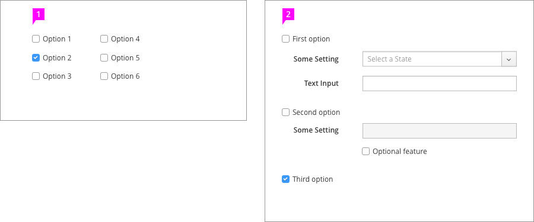
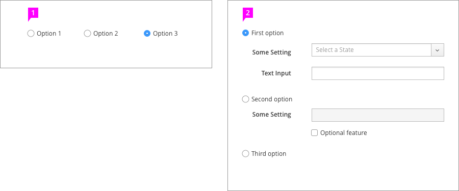
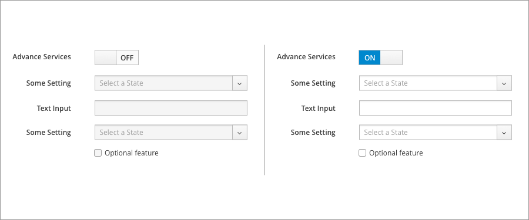
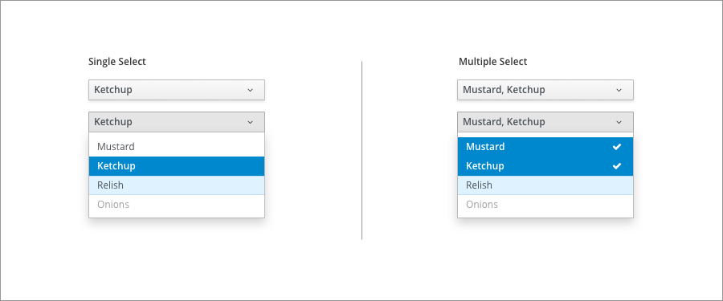
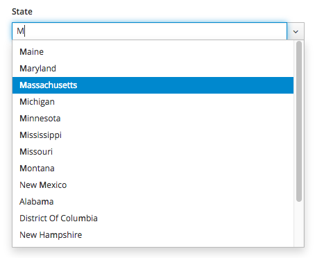
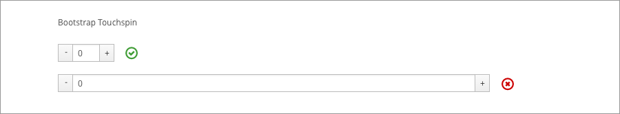
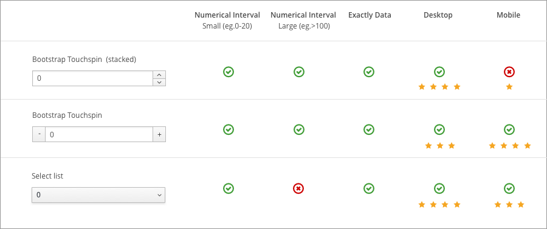
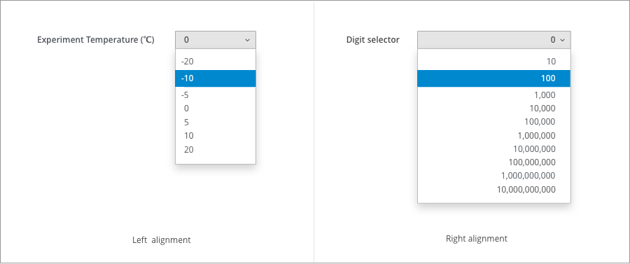
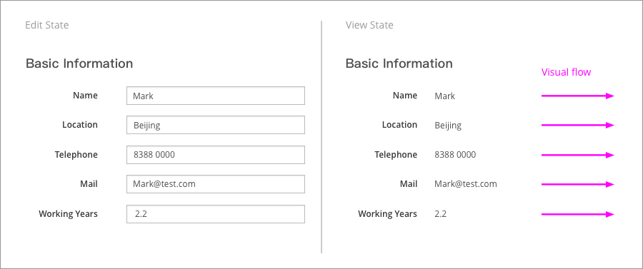
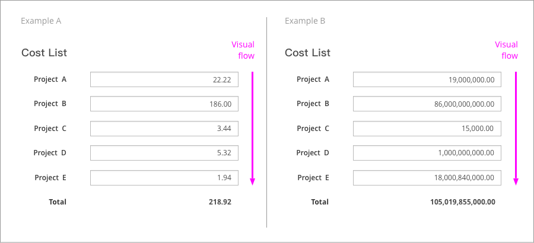

# Data Input

Selection Controls: [Checkboxes](#checkboxes), [Radio Buttons](#radio-buttons), [Switches](#onoff-switches), [Select Lists](#select-lists), [Comboboxes](#comboboxes)

Data Entry Controls: [Text Entry](#text-entry), [Bound-Entry Controls](#bound-entry-controls), [Bootstrap Touchspin](#bootstrap-touchspin), [Bootstrap Select](#bootstrap-select), [Left-Alignment or Right-Alignment](#left-alignment-or-right-alignment)

## Selection Controls

### Overview
You should choose a selection control pattern based on the number of choices available to the user.
* Use [Radio Buttons](#radio-buttons) or [Checkboxes](#checkboxes) when you need to select from two to five known choices.
* When there are more than five choices, when layout space is limited, or when there are variable choices, use a [Select List](#select-lists).
* Use a [Switch](#onoff-switches) input to allow the user to toggle between enabled and disabled states.

Implement these patterns in a well-structured layout to avoid visual clutter.

### Details

#### Checkboxes
You should use Checkboxes when users need to select one or more items from a list of known options. When possible, arrange Checkboxes vertically to facilitate easy visual scanning. If there are many items and labels are short, use a multi-column grid arrangement to save vertical space.

If necessary, you can nest other controls within a Checkbox item. Enable and disable nested options when the user selects or unselects a check box.

1. Checkboxes arranged in a two-column grid to conserve vertical space
2. Checkboxes with nested controls

#### Radio Buttons
Radio Buttons allow users to make mutually exclusive selections. You must include more than one Radio button in a group, and only one selection can be active at a time.

To allow users to select a null option, use "None" or a similar term to represent that choice.

You may arrange Radio Buttons vertically or horizontally according to your preference. However, vertically-arranged Radio Buttons are easier for users to scan.

Like Checkboxes, you can use Radio Buttons to nest other controls , following the same guidelines for enabling or disabling options.

As a general rule, you shouldn't use Radio Buttons when more than two to five options are available or if there are space constraints. In these cases, try using a [Select List](#select-lists) instead.

1. A horizontal group of Radio Buttons
2. A vertical group of Radio Buttons with nested controls

#### On/Off Switches
Use an On/Off Switch when a user is presented with the binary choice to enable or disable some optional attribute or capability. In such a case, Switches are an excellent alternative to a single Checkbox or set of two Radio Buttons.

Since the Switch pattern is only used to enable or disable an attribute, you can simplify labeling when using a Switch by using only the name of the affected attribute. If the options you're presenting to the user are anything other than "on" or "off," you should use [Radio Buttons](#radio-buttons) instead of Switches.

Just like Radio Buttons and Checkboxes, Switches can be used to enable or disable a set of nested controls.

#### Select Lists
You should use Select Lists when there are more than five known options, or when space is too limited for Radio Buttons. Select Lists should also be used when options are dynamic or variable.

PatternFly offers two types of select controls, Bootstrap Single Select and Bootstrap Multi Select.
* Use [Bootstrap Single Select](http://www.patternfly.org/pattern-library/widgets/#bootstrap-select) for selecting a single, mutually exclusive option.
* Use [Bootstrap Multi Select](http://www.patternfly.org/pattern-library/widgets/#bootstrap-select) for selecting one or more options.

When fewer than five options exist, you should use [Radio Buttons](#radio-buttons) or [Checkboxes](#checkboxes) to display all options to the user simultaneously.

#### Comboboxes
A combobox allows users to type a value into the field *or* select a predefined option from the dropdown list. Comboboxes also support type-ahead features, where a filtered list of options is displayed as the user types. This makes it easier to select a preferred option when there are too many options to quickly scan the full list.

You should use a combobox in place of a single Select List when there are more than ten options.

## Data Entry Controls
### Overview

You should choose a data entry control pattern that is optimized for the type of data a user will input. In some cases, users may need to select from a fixed set of options. In other cases, they may need to input a value directly.
* Use *bound-entry controls* like the [Datepicker](http://www.patternfly.org/pattern-library/forms-and-controls/datepicker/), [Timepicker](http://www.patternfly.org/pattern-library/forms-and-controls/timepicker/), or [Touchspin](#bootstrap-touchspin) when entering strictly-typed data. This will reduce the need for field-level validation and prevent user input errors.

When implementing these patterns, you should take notice of the alignment of data. Consider data comparison and visual flow when deciding to left- or right-align data entry controls.

### Details

#### Text Entry

Text Fields are common, simple inputs for allowing a user to enter a string of characters from the keyboard. When using text fields in forms, the following are some factors to keep in mind.

* Be sure to size Text Fields appropriately to anticipate the longest likely value (if a maximum character length is known). When a value is too long to be fully displayed in a Text Field, use [truncation](http://www.patternfly.org/styles/terminology-and-wording/#_).
* Always provide a label.  Do not include a colon at the end of the label. Visit the Capitalization section of Terminology and Wording for information regarding capitalization.
* Pre-populate fields with known values when possible (eg. default IP address.)
* When presented in a form, the initial input field is usually the first input field which is required. The primary input field should receive focus, when the form is presented to the user.

##### Notes about keyboard interactions: 
* Support Enter key for submit (eg. “Save”), or any other primary form action.
* If there is only one input field, pressing Enter key behaves the same as clicking the primary button.
* Support Tab key (to progress forward) and Tab+Shift keys (to move backward) to move between input fields.
* Support the Tab key for all interactive elements. The sequence of tab indices should be determined according to the positions of the elements, from top to bottom, from left to right.
* When presented in a modal dialog, allow the Esc key to dismiss the window without saving changes.

If users must enter specifically-formatted data into the Text Field, use syntax hints and field validation to prevent data entry errors.

#### Bound-Entry Controls
Use bound-entry controls should be used to enter special data types, such as dates, times, and other numeric data. Bound-entry Controls constrain user input and combine keyboard and mouse interaction. These controls are designed to only allow valid inputs. As a result, field validation is unnecessary. See the [Datepicker](http://www.patternfly.org/pattern-library/forms-and-controls/datepicker/), [Timepicker](http://www.patternfly.org/pattern-library/forms-and-controls/timepicker/), and [Bootstrap Touchspin](http://www.patternfly.org/pattern-library/widgets/#bootstrap-touchspin) components for details.

The dialog box above uses bounded data entry controls to prevent user errors. A Datepicker, Timepicker, Touchspin control, and Select List are used to input properly-formatted data into the form.

#### Bootstrap Touchspin
PatternFly provides two variations of the [Bootstrap Touchspin](http://www.patternfly.org/pattern-library/widgets/#bootstrap-touchspin) control: a control with *stacked buttons*, and a control with *unstacked buttons*.

On large-screen devices, the Touchspin control with *stacked buttons* is the recommended method for entering numeric data on a web form and can provide a superior user experience. However, the size and placement of the control buttons is inadequate for small-screen devices with touch inputs. To avoid input errors with the stacked controls on small devices, use the control with *unstacked buttons*.

When using the Touchspin control with *unstacked buttons*, the width of the field will have a significant influence on the user experience. A field that is too wide will frustrate users who need to move between the buttons. To avoid this, adjust the width of the input fields to match the length of the expected input value.

#### Bootstrap Select
[Bootstrap Select]( http://www.patternfly.org/pattern-library/widgets/#bootstrap-select) can also be used to enter numeric data. This pattern helps users select a value quickly and accurately, preventing user input errors. This is especially true in the usage scenarios for selecting data from some special data group (eg. -20 / -10 / -5 / 0 / 5 / 10 / 20).

When using a Select List, options should be less than twenty. Long Lists that require scrolling are not easy to operate on mobile devices.

#### Left-Alignment or Right-Alignment
When you're deciding to left- or right-align data in an entry control, consider the context of the data, the type of data, and the type of input.

##### Left Alignment
Users generally scan information from left to right, moving from the top of a section to the bottom. Left-aligning information can make it easier for users to move their eyes from one line of data to the next by providing a consistent starting point for each line.

##### Right Alignment
Right-aligning integer strings allows the numbers to be easily compared, as decimals and comma separators are aligned. This increases contrast between lines of data.

Right-alignment is most useful for displaying pure numeric values and decimal values, because users can easily scan the values from top to bottom. Right-aligned data also supports increased number legibility in table layouts.

You should keep in mind that right-aligned numeric text entry fields may be difficult to edit once the user has inputted a value. The user would be forced to click within the small space between the end of the number value and the right end of the field to add digits to the value. This is even more difficult on touchscreen interfaces.
