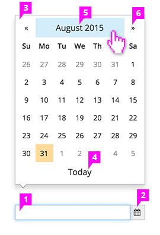

# Datepicker

## Description

1. **Input Field:** At this time, we recommend that the datepicker field is read only due to the limitations of the input validation.
1. **Calendar Icon:** The calendar icon is shown on the right.
1. **Calendar:** The calendar is displayed when the user clicks on the input field.
1. **Today Button:** This button is a shortcut to select today’s date.
1. **Datepicker Switch:** Change the view of the calendar to month or year by clicking on the calendar header.
1. **Previous and Next Buttons:** Allows the user to navigate through the months or years.
