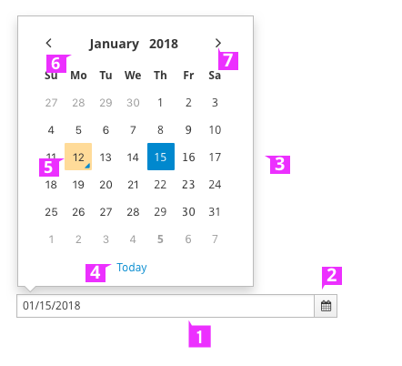
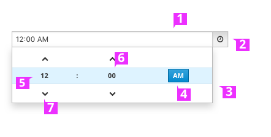
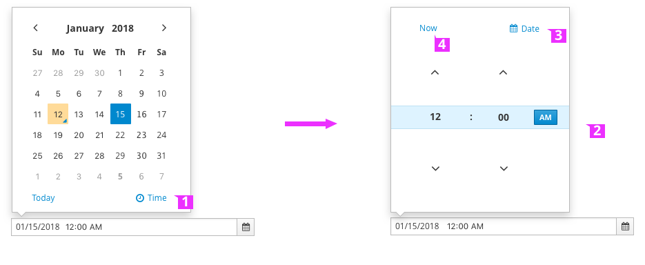
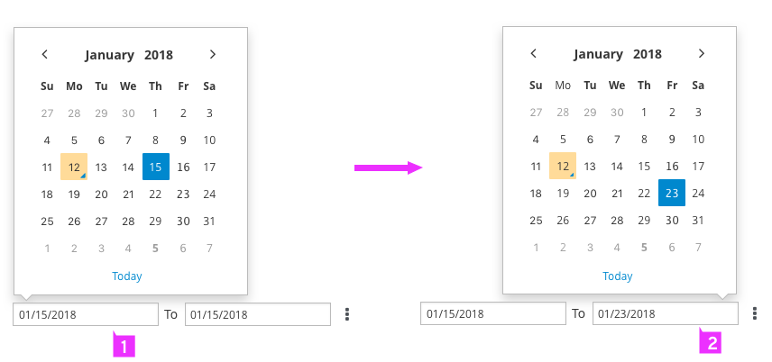
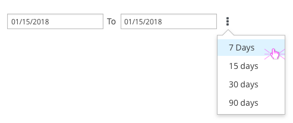
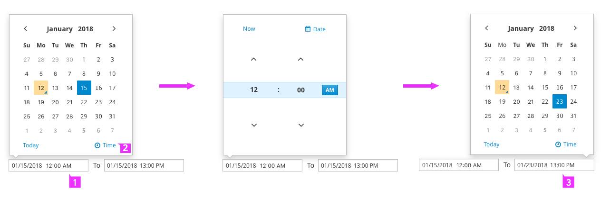

# Date and Time Picker
Date and Time picker has a number of variations, jump to a section below for applied examples:
* [DatePicker](#DatePicker Expanded)
* [TimePicker](#TimePicker Expanded)
* [DateTimePicker](#DateTimePicker Expanded)
* [DateRangePicker](#DateRangePicker Expanded)
* [DateTimeRangePicker](#DateTimeRangPicker Expanded)

 
### DatePicker
 

1. **Input Field:** The datepicker field is read only due to the limitations of the input validation.

1. **Calendar Icon:** The calendar icon is shown on the right.

1. **Calendar:** The calendar is displayed when the user clicks on the input field.

1. **Today Button:** This button is a shortcut to select today’s date.

1. **Today indicator:** Today indicator: The indication of Today’s date.

1. **Month and Year Switch:** Change the view of the calendar to month or year by clicking on the calendar header.

1. **Previous and Next Buttons:** Allows the user to navigate through the months or years.

### TimePicker
 

1. **Input Field:** The Timepicker field is read only due to the limitations of the input validation.

1. **Time Icon:** The time icon is shown on the right.

1. **Time:** The Time is displayed when the user clicks on the input field.

1. **AM and PM Buttons:** Allows the user to toggle between AM and PM.

1. **Select Hour:** Use the picker to select the hour.

1. **Select Minute:** Use the picker to select the minute.

1. **Up and Down Buttons:** Allows the user to step through the hours or minutes.

### DateTimePicker

 

DateTimePicker is a combination of DatePicker and TimePicker. Refer to the [DatePicker](#DatePicker Expanded) and [TimePicker](#TimePicker Expanded) for more details about design guidance.

1. **TimePicker Switch:** Allows users Change the view of the calendar to Time.

1. **TimePicker:** The TimePicker is displayed when the user clicks on the TimePicker Switch.

1. **DatePicker Switch:** Allows the user to change the view of Time to Calendar.

1. **Now Button:** This button is a shortcut to select current time.

### DateRangePicker
 

DateRangePicker is a combination of two DatePickers. Refer to the [DatePicker](#DatePicker Expanded) for more details about design guidance.
1. **StartDate Input Field:** When the user clicks on the StartDate Input Field, the calendar is display for selecting a StartDate.

1. **EndDate Input Field:** When the user clicks on the EndDate Input Field, the calendar is display for selecting an EndDate.

### Selecting Predefined Ranges

1. **Predefined Range (optional):** This action allow user to quickly select some predefined ranges, such as : 7 days, 15 days, 30 days... The Options available in the  dropdown menu may be any number of days.

  - When both the StartDate and the EndDate field are empty, user clicks “7 days “, the date range selected will be 7 days starting from Today’s date.

  - When the StartDate is filled, user clicks “7 days “,  the date range selected  will be 7 days after the StartDate.

  - When the EndDate is filled, user clicks “7 days “, the date range selected  will be 7 days before the EndDate.

### DateTimeRangePicker
 

DateTimeRangePicker is a combination of Two DateTimePickers. Refer to the [DateTimePicker](#DateTimePicker Expanded) for more details about design guidance.

1. **StartDate Input Field:** When the user clicks on the StartDate Input Field, the calendar is display for selecting a StartDate.

1. **TimePicker Switch:** Allows users Change the view of the calendar to Time.

1. **EndDate Input Field:** Allows the user to change the view of Time to Calendar.

1. **Now Button:** When the user clicks on the EndDate Input Field,the calendar is display for selecting an EndDate.
