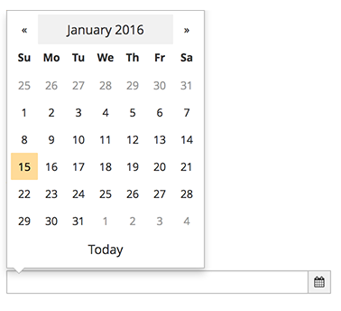

# Datepicker

The datepicker allows a user to select a single date. The most common use case is selecting a date for something to run or expire. The datepicker widget is based on the Bootstrap-datepicker. See the [bootstrap-datepicker doc](http://bootstrap-datepicker.readthedocs.io/en/latest/) for complete documentation.

This pattern should NOT be used when selecting a date range.

