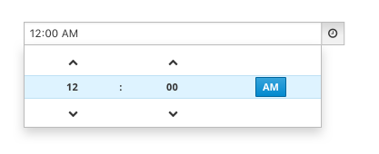
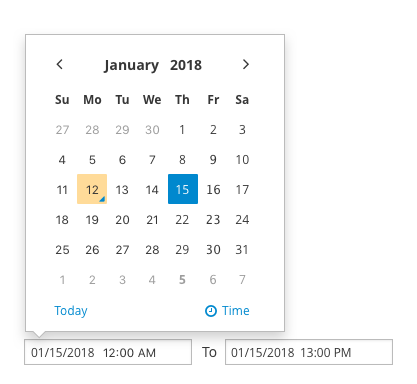

# Date and Time Picker

The date and  time picker allows a user to select a single point in time or a time range. Time can be expressed as a date, a time of day, or a combination of both. Common use cases are selecting a date and time for something to run or expire and filtering events by their timestamp. The date and time picker is based on the Bootstrap-datetimepicker. See the
[bootstrap-datepicker doc](http://http://eonasdan.github.io/bootstrap-datetimepicker/) for complete documentation.

There are number of variations of the date and time picker, jump to a section below for applied examples: 
* [DatePicker](#DatePicker)
* [TimePicker](#TimePicker)
* [DateTimePicker](#DateTimePicker)
* [DateRangePicker](#DateRangePicker)
* [DateTimeRangePicker](#DateTimeRangPicker)

### DatePicker
The DatePicker allows a user to select a single date.
 

### TimePicker
The TimePicker allows a user to select a single Time.
 

### DateTimePicker
The DateTimePicker allows a user to select a date with a time.
 

### DateRangePicker
The DateRangePicker allows a user to select a range of date.
 

### DateTimeRangePicker
The DateTimeRangPicker allows a user to select a range of date with time.
 

