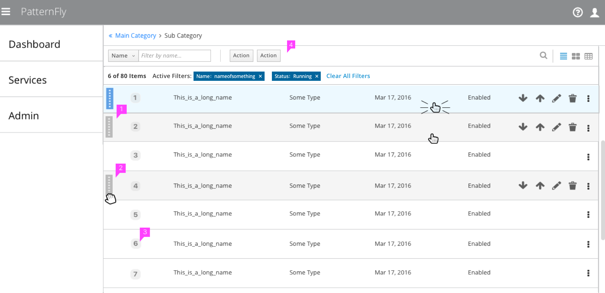
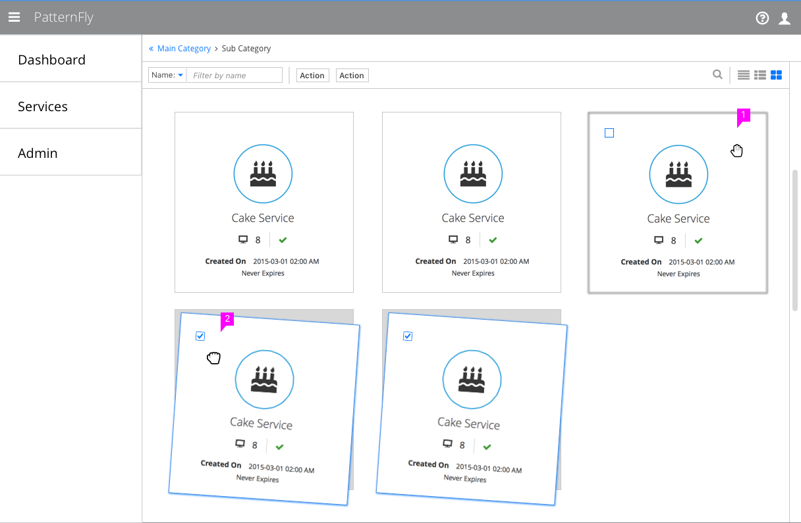
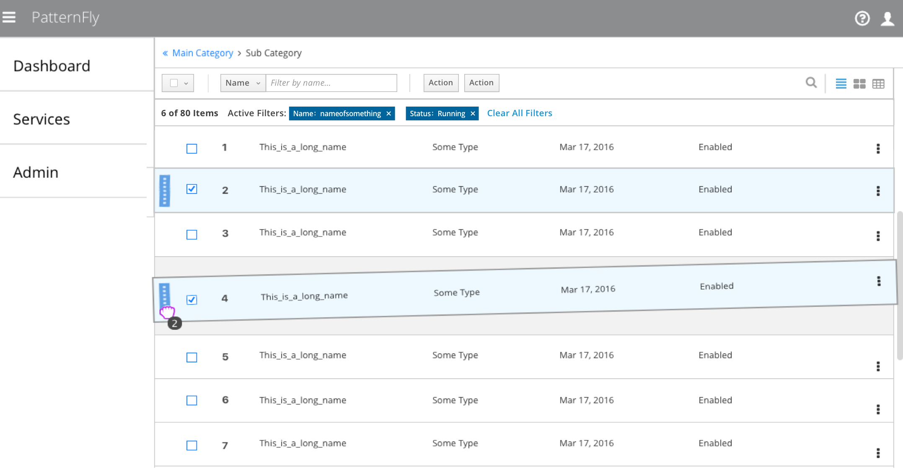

# Drag and Drop

## Vertical Lists

1. **Handle Icon:**
  * When a user hovers over a row or selects a row, the handle icon should appear.
  * The icon placement is to the far left of the row. If checkboxes are being used for multi-select, the handle icon should be to the left of the checkboxes.

2. **Cursor Change:**
  * When a user hovers over the handle icon, the cursor should change to an open hand, signifying the item can be dragged.
  * (Optional) If you choose to display the handle icon on unselected rows as well, the icon should appear visually disabled so it does not distract from the content.

3. **Item Sequence** (optional): 
  * If the order of items is important, the order number should be clearly labeled.
  * When an item is being moved, the order numbers should not change to reflect the move until the item has been successfully dropped in a new location.

4. **Toolbar:**
  * When a PatternFly [Toolbar](http://www.patternfly.org/pattern-library/forms-and-controls/toolbar/#_) (some combination of filter, sort, find, views and action buttons) is being used, it should not include sorting.
  * Users will sort manually with the drag and drop functionality.

## Horizontal Lists

  

1. **Handle Icon:**
  * The handle icon should not be used when applying drag and drop to horizontal lists, card views, or dashboards.
  * When a user hovers over an item or selects an item (anywhere that is not already a link, checkbox, button, etc), it should be visually indicated and the cursor should change to an open hand, signifying this item can be moved.

2. **Multi-Selection** (optional):
  * If multi-selection is being supported, checkboxes should be used for moving multiple items at once.
  * Dragging multiple checked items will move the items as a group and will place them consecutively when dropped in the list.

## Drag and Drop Interactions

  

* **Hover:** When a user hovers over the draggable area of an item, the cursor changes to an open hand.  
* **Click:** When a user clicks and holds to drag an item, the cursor changes to a closed fist and the item selection is visually indicated.
  * For vertical lists, users must click on the handle region in order to select a row to drag.
  * For horizontal lists, the handle icon is not needed and users can click anywhere to select the item to drag.
  * For mobile devices and tablets, the entire item should always be selectable regardless of view type.
  * Multiple rows can be selected in order by holding the shift key and selecting.
  * Multiple rows can be selected out of order by holding the ctrl key and selecting.
  * For MacOS, multiple rows can be selected out of order by holding the command key instead.
* **Drag initiated:**  The item being dragged should “pop up” and be shown in focus with a larger slot left behind. The slot should be visually indicated.
  * If more than one item is being moved at once, a tool tip should indicate the number of items being moved.
* **Hover over accepted target:** The closed fist cursor should move with the item as it is dragged and the empty grey slot should move to indicate where the item will be placed when dropped.
* **Hover over denied target:** An icon should appear next to the cursor to signify an invalid drop target and the empty grey slot should remain at the original location where the item was selected.
* **Drop over accepted target:** The item should occupy the slot and if part of a sequence, the order numbers should change to reflect the new order of items.
  * If dragging multiple items, the items will be placed consecutively where the slot was indicated.
* **Drop over denied target:** The item should be returned to its original location.

## Accessibility Options

* **Select items to Drag:** Use the tab key to go through items in the list. Use the spacebar to select an item to move. Use shift/tab to reverse directions through the list.
* **Select multiple items to Drag:** Hold shift to select multiple items in a sequence. Hold ctrl to select multiple items out of order.
* **Drop Item(s):** Use the up and down arrow keys to choose a destination. Press Enter to drop items in place.
