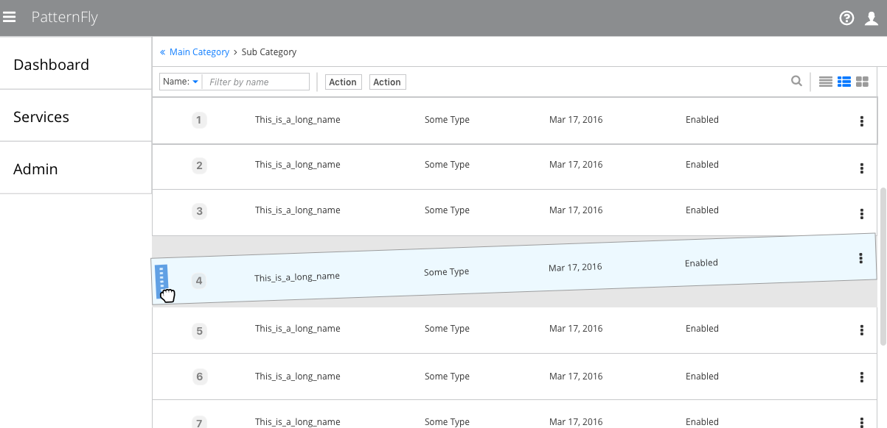
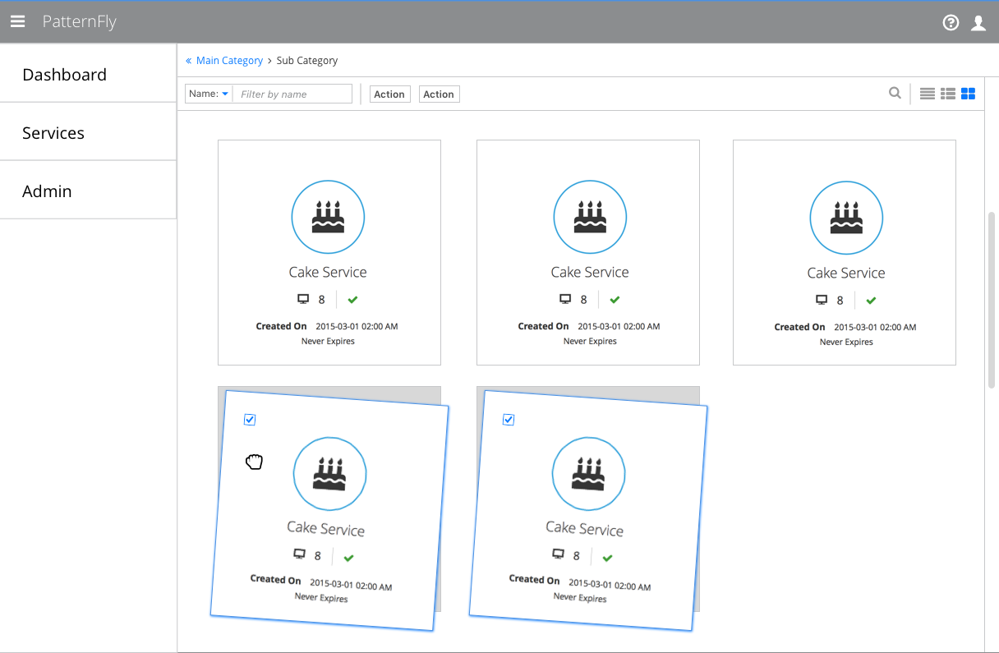

# Drag and Drop

The drag and drop pattern allows users to rearrange or reorder items in a group by moving them from one place to another. This pattern can be used in a variety of areas, with some common examples including: tables, list views, card views, and dashboards.

## List View Example

## Card View Example

