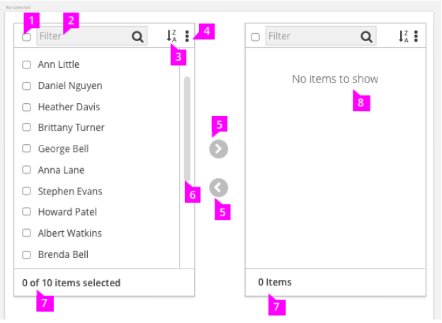
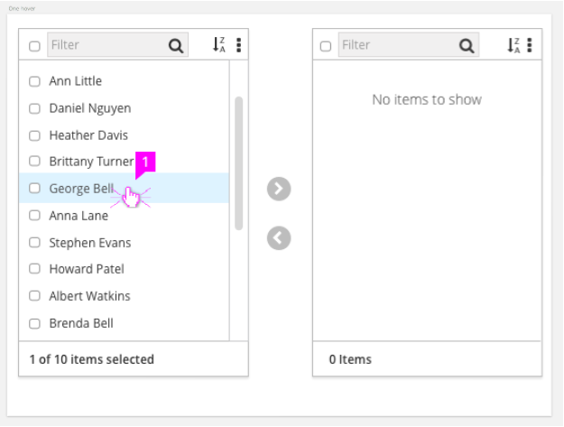
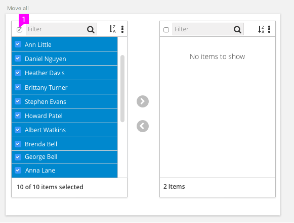
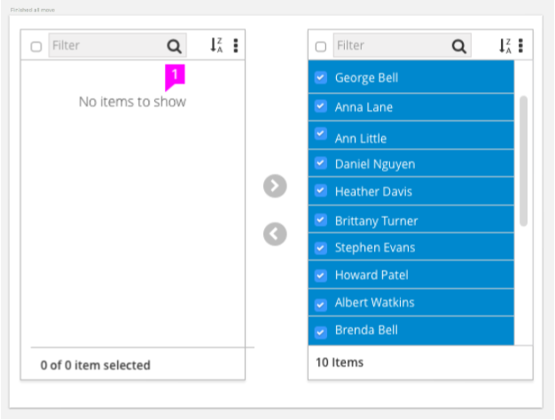
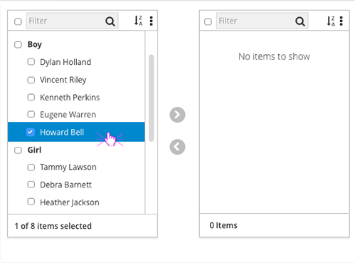

# Dual Pane Selector

Dual Pane Selectors allow users to visually compare available and selected items and move items between those states.  They are best used when more than 30 items appear in a list, a many to many data model is needed or if there is a specific applicable use case. Lists under 30 items should consider using the [Bootstrap Multiple Select widget](http://www.patternfly.org/pattern-library/widgets/#bootstrap-select).

## Default State

  1. **Select All**
    - Selects all items in the list.
    - When some items are selected, if the user then clicks the Select All button, all items will then be selected. Clicking again will deselect all items.

  1. **Filter/Search**
    - Type-ahead filter allows you to easily reduce long lists to more quickly find items.

  1. **Sort** (optional):
    - Default sort will be alphabetical.
    - Add
    itional sorting options are dependent on the data.
  1. **Action Menu** (optional):
      - Additional actions can be presented as a button.

  1. **Item  Movement Buttons**
    - Used to move selected items between the two state panes.

  1. **Scrolling**
      - The panes should have flexible widths and a maximum height.
      - The pane may decrease in height as the items move out of a list, but a maximum height limit would be met with a scroll to accommodate additional list items.
      - Both panes should be of equal height.

  1. **Item Count Labels**
      - The bottom of each pane should have a count to the number of items selected out of total items available.

  1. **Empty State**
      - Empty panes should possess an Empty State message to inform users that there are no selections to be made, or no items have been selected.

## Selecting and Moving Items

1. **Hover Highlight**
  - Highlight should exist on hover.

1. **Selected Highlight and Checkmark**
  - Selected items are highlighted with the checkmark state changed to include checked icon to visually reinforce item selection. This is particularly useful when multiple selections have been made.

1. **Moving an Item**
  - After an item(s) has been selected, the Shuttle Buttons move the items to the desired state pane.
  - After items are moved they remain highlighted in their new state pane as visual confirmation. They remain highlighted until a new selection is made. This is so item movement can be easily undone.
  - If no known sort methodology is determined, items will added to the bottom of the list.

1. **Selecting within both panes**
  - The panes participate in mutually exclusive interaction. Only the items in one state pane may be selected at any give time. All checkboxes are active until a selection is made within one pane. Checkboxes should be disabled for the non active pane.

## Bulk Moving

1. **Select All**
  - When Select All is clicked, all items are highlighted following the above highlight and move rules.
  - Clicking the box again will deselect all.

## Empty State on Selection Pane

1. **Initial Pane is Empty**
  - When all items are selected and removed from the first state pane an Empty State message should be shown letting the users know there are no other items available for selection.

## Nesting

1. **Parent and Child Selections**
  - Parent items contain checkboxes that will select all child items underneath that parent.
  - Child components contain check boxes to allow their individual selection.
  - Clicking the arrow moves it to the corresponding pane.
