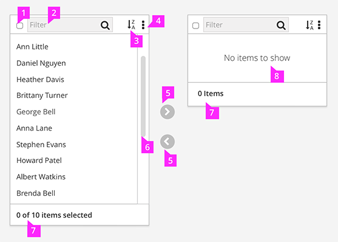
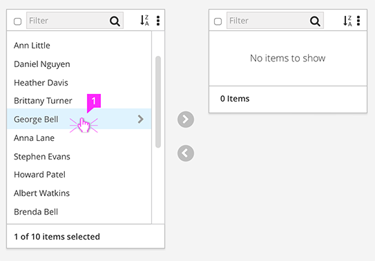
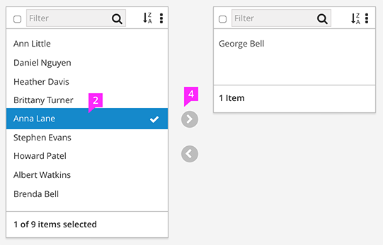
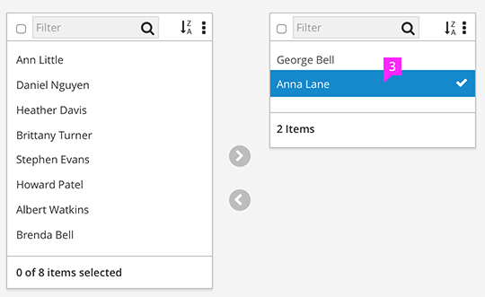
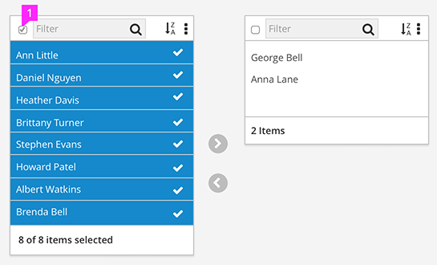
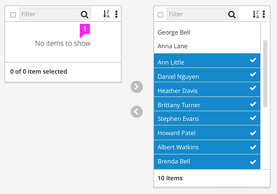
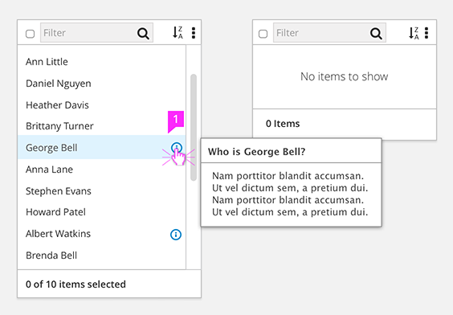
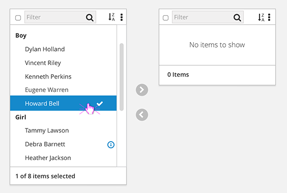
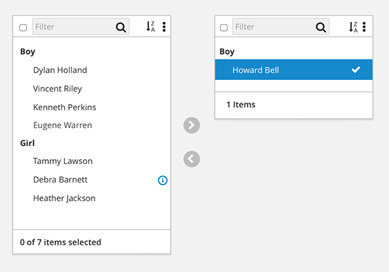

# Dual Pane Selector

The Dual Pane Selectors allow users to visually compare available and selected items and move items between those states.  It is recommended to use when:
- A user needs to move items from one list to another.
- A many to many data model is needed
- A user needs to visually distribute items between lists.

When those conditions are not met, the [Bootstrap Multiple Select widget](http://www.patternfly.org/pattern-library/widgets/#bootstrap-select) should be considered.

The inspiration and basis for this design can be found at: http://bootsnipp.com/snippets/featured/bootstrap-dual-list

## Default State

  1. **Select All**
    - Selects all items in the list.
    - When some items are selected, if the user then clicks the Select All button, all items will then be selected. Clicking again will deselect all items.

  1. **Typeahead Filter**
    - Typeahead filter allows you to easily reduce long lists to more quickly find items.

  1. **Sorting**(optional)
    - Default sort will be alphabetical.
    - Additional sorting options are dependent on the data.
    - Sorting will not negate already selected items that may not be currently visible because of sort.

  1. **Additional Actions** (optional)
      - Additional actions can be presented as a button.
      - More than one action should be presented in a kebab.

  1. **Shuttle Buttons**
    - These are used to move selected items between the two state panes.

  1. **Pane Width/Height and Scrolling**
      - The panes should have flexible widths and a maximum height.
      - The pane may decrease in height as the items move out of a list, but a maximum height limit would be met with a scroll to accommodate additional list items.

  1. **Item Count Labels**
      - The bottom of each pane should have a count of the number of items selected.

  1. **Empty State**
      - Empty panes should possess an Empty State message to inform users that there are no selections to be made, or no items have been selected.

  1. **Info Tooltip** (optional)
      - The info icon (pficon-info) placed on the right hand side of the row allows the user to see additional information about that item.

  1. **Nesting** (optional)
      - Items can be organized in groups (nested). Clicking the chevron will expand and collapse the group.

## Selecting and Moving Items

1. **Selection**
  - The standard highlight should exist on hover.
  - Selected items are highlighted with the addition of a checkmark icon (fa-check) to visually reinforce item selection. This is particularly useful when multiple selections have been made.

1. **Selecting within both panes**
  - The panes participate in mutually exclusive highlighting. Only the items in one state pane may be selected at any give time.

1. **Moving an Item**
  - After an item(s) has been selected, the shuttle buttons move the items to the desired state pane.
  - After items are moved they remain highlighted in their new state pane as visual confirmation. They remain highlighted until a new selection is made.
  - If no known sort methodology is determined, items will be added to the bottom of the list.
  - You may also move an item to the opposite pane by double clicking.

## Bulk Moving

1. **Select All**
  - When "Select All" is clicked, all items are highlighted following the pattern outlined in the "Selection" portion of this documentation.
  - Clicking the box again will deselect all.

## Empty State on Selection Pane

1. **Empty State**
  - When all items are selected and removed from the first state pane an Empty State message should be shown letting the users know there are no other items available for selection.

## Optional Features

1. **Info Tip**
  - An optional Info Tip can be added to provide further information about the item. Activated on hover.

  

1. **Nesting**
  - Nesting for objects that require grouping.
  - Moving items will also move the parent for context.
