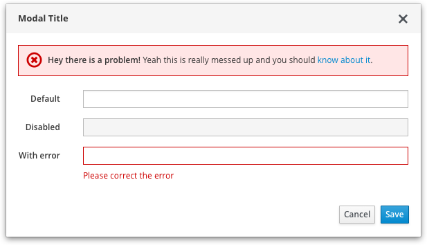

# Errors and Validation

If a form field submission results in an error, it must be indicated to the user. Errors are always presented on individual form fields, they might also be indicated with an inline notification.

### How to perform validation
* Text input fields with validation errors are indicated with a red border around the input box and a Field Error Message below the field describing the error.
  * Field Error Messages should be specific and offer solutions. Example: The "@" character in "user@application" is not allowed. Try "user_at_application" instead.
  * When the error message is presented, content below will automatically get pushed out of the way to accommodate it.
* An (optional) inline notification might be presented as well, depending on the use case. See “Server-side validation”.

### When to perform validation
* When possible, it's best to perform inline validation as the widget loses focus so that the user is immediately informed of invalid information. The validation will disappear after user modify the content within the field. However, inline validation shouldn’t be overused as user may feel frustrated.
* When a required field is not filled or a wrong format is input, we recommend showing a validation as the widget loses focus.
* In some cases (e.g. setting the password), we may consider performing a real-time validation while user filling the field. See “Client-side validation”.

### When to disable submit button
* Generally, when a form is submitted, the submit button should be disabled to avoid duplicate submission. Also, progress indicators (spinner or progress bars) should be used if the time to process the form submit action would exceed users’ expectations. For more information about progress indicators, see: [spinner](https://www.patternfly.org/widgets/#spinner) and/or [progress](https://www.patternfly.org/widgets/#progress).
* For wizard, disable submit button until all required form inputs have been satisfied.

### Client-side validation
When the user leaves a field, and the field loses focus, a validation error message will be presented dynamically on that field if an error exists. Note: Some use cases might require validation as the user types, where the syntax for each character is checked. For example: Checking IP address fields where the only valid characters are numbers and periods.

* Ensure validation is relevant to the field.
  * Example: Invalid characters for text input fields
* Depending on application constraints, dynamic (on-the-fly) dismissal of errors would be ideal as it provides a visual cue that the user has corrected the error.

### Server-side validation
When the user submits the form, the entire page is reloaded with indications of validation errors for each field.
It is recommended that an inline notification get presented, at the top of the main content area, to assist the user in finding and correcting the specific field errors.

* The notification message should describe the error(s) and offer guidance for resolution. It might also include a count of the number of error(s). A total count is useful for long forms where individual field errors might be outside of the user’s current view.
* Once form errors are resolved and submitted, the inline (error) notification should be replaced with a confirmation message.

See [Inline Notifications](https://www.patternfly.org/widgets/#progress) for more information.
