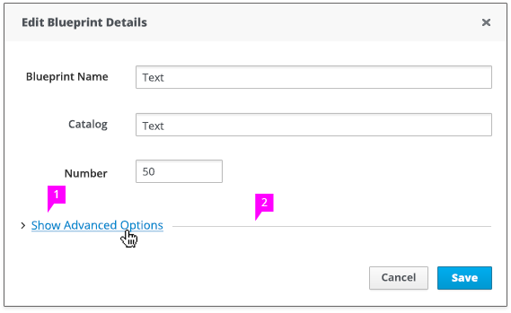
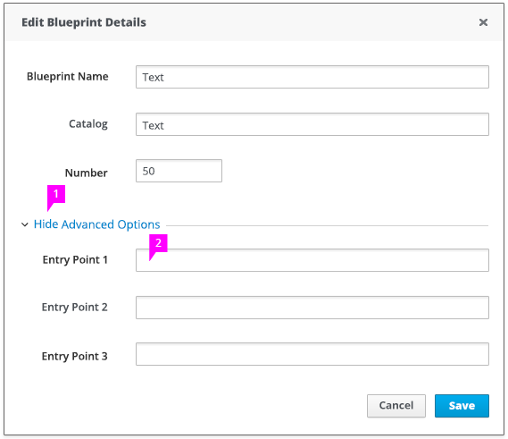

# Expand/Collapse Section

## Collapsed

1. **Caret Icon and Label:** The caret icon indicates that you can expand or collapse the section. By default, the advanced section is collapsed. The collapse / expand section displays text as a blue link. The "Show Advanced Options" text denotes that the section will expand on click.

2. **Divider Line:** The divider line provides a distinction between the "Advanced Options" area and the sections above.

*Please note: if there is not a specific grouping label, "Show Advanced Options" is a possible generic label option. If there are more specific labels that help users to understand the context of what is being hidden then it is recommended that you use those labels to improve usability.*

## Expanded

1. **Caret Icon and Label:** When expanded, the caret icon faces down. The "Hide Advanced Options" denotes that the section will collapse on click.

2. **Expanded Content:** The content under "Advanced Options" is shown underneath the divider line when the section is expanded.
