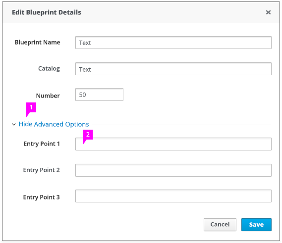

# Expand/Collapse Section

## Collapsed Section

1. **Caret Icon:** The caret icon indicates that you can expand or collapse the section. By default, the advanced section is collapsed.
 **Label:** The collapse / expand section displays text as a blue link. Clicking on the text will expand the area.

2. **Divider Line:** The divider line is used to divide the two distinct sections.
  
**Please note: if there is not a specific grouping label, "Advanced Options" is a possible generic label option. If there are more specific labels that help users to understand the context of what is being hidden then it is recommended that you use those labels to improve usability.*

## Expanded Section

1. **Caret Icon:** When expanded, the caret icon will be facing down.

2. **Additional Fields:** Will be shown under the divider line when section is expanded.

## Keyboard Accessibility

* Users should be able to use the keyboard to navigate to the control (i.e., it should gain focus) and press enter to activate the control.
* Tooltips are also a requirement for accessibility.
