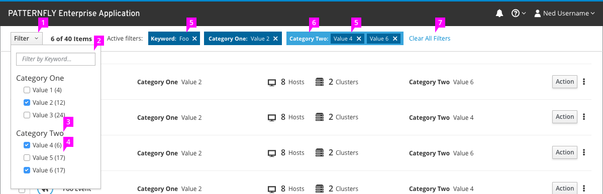

# Faceted Filter

1. **Filter Dropdown** (optional)**:** Clicking this dropdown opens and closes the filter panel. A faceted filter embedded in the page does not require a dropdown.
1. **Filter Textbox** (optional) **:** If a text-based filter such as a keyword filter is required, a textbox may be included at the top of the filter panel. No more than one textbox should be included in a faceted filter if possible. If more than one is required, consider using a [different filter pattern](http://www.patternfly.org/pattern-library/forms-and-controls/filter/) instead.
1. **Filter Category:** These labels describe the category of the values below them. Examples include "Color", "Status" etc.
1. **Filter Value:** Examples include "Red", "Blue", "Running", "Stopped", etc. Clicking the checkbox next to a value will add a filter for that value and its associated category. If possible, values should be accompanied by a number in parentheses that represents the number of items in the set that match that value.
1. **Active Filter:** Filters that have been added to the current view appear along the top of the page. Clicking the X on the filter will remove it and uncheck the associated box.
1. **Active Filter Category:** When more than two or more filters in a category is active, they are shown grouped together and labeled with their category.
1. **Clear All Filters:** Clicking this button will remove all active filters from the page and uncheck all checkboxes.
