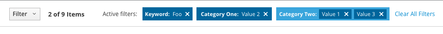
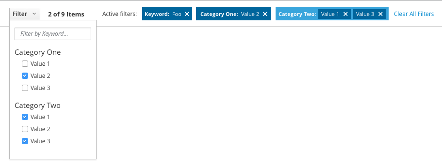
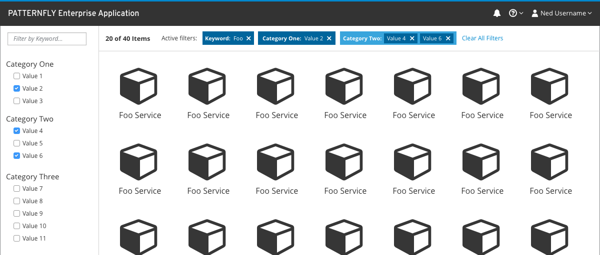

# Faceted Filter

Faceted filter is a variation on the [Filter pattern](http://www.patternfly.org/pattern-library/forms-and-controls/filter/) that enables users to add and remove filters primarily by checking and unchecking boxes next to filter criteria. A text field may be included for keyword filters when necessary, however.

Use a faceted filter when...
- The user is browsing a set of items without robust knowledge of what is in the set.
- The important characteristics of the items to be filtered are mostly traits with a small and discrete set of choices like color, status, availability, or distributer rather than arbitrary text or numeric values such as name, date created, or amount of available space.

Faceted filters can be presented either as a dropdown in the [Toolbar](http://www.patternfly.org/pattern-library/forms-and-controls/toolbar/) or as a dedicated column on a content view.

## Faceted Filter in Toolbar

### Closed

### Open

## Faceted Filter in Sidebar

