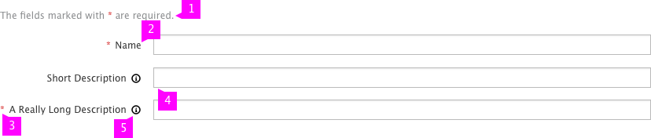
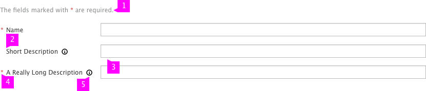

# Field Labeling

## Right-Aligned Labels

1. **Message:** There should be a message to let the user know what the required field indicator means
1. **Label Alignment:** The right-most edge of the field label’s text should be vertically aligned with the right-most edge of the field label text (or if applicable, the field level help icon) above and/or below itself.
1. **Required Indicator:** If this field is required (and there are optional fields in the form as well), the required field indicator should be to the left of the field label, but within the form’s overall margin.
1. **Component Alignment:** The field component should be to the right of the field label.
1. **Field Level Help:** If there is [field level help](http://www.patternfly.org/pattern-library/forms-and-controls/help-on-forms/) for this field, the icon should be to the right of the field label and left of the field component.

## Top-Aligned Labels

1. **Message:** There should be a message to let the user know what the required field indicator means
1. **Label Alignment:** The left-most edge of the field label should be vertically aligned with the left edge of its corresponding field component below it.  If there is a required field indicator, it becomes the “left-most edge” of the field label and should be vertically aligned the same.
1. **Required Indicator:** If this field is required (and there are optional fields in the form as well), the required field indicator should be to the left of the field label, but within the form’s overall margin.
1. **Component Alignment:** The field component should be aligned below the field label.
1. **Field Level Help:** If there is [field level help](http://www.patternfly.org/pattern-library/forms-and-controls/help-on-forms/) for this field, the icon should be to the right of the field label.

## Left-Aligned Labels

1. **Message:** There should be a message to let the user know what the required field indicator means.
1. **Label Alignment:** The left-most edge of the field label should be vertically aligned with the left-most edge of the field label below it.  If there is a required field indicator, the field labels text should be aligned with one another.
1. **Component Alignment:** The field components should be vertically aligned with one another by their left-most edges and to the right of the longest field label.
1. **Required Indicator:** If this field is required (and there are optional fields in the form as well), the required field indicator should be indented to the left of the field label, but within the form’s overall margin.
1. **Field Level Help:** If there is [field level help](http://www.patternfly.org/pattern-library/forms-and-controls/help-on-forms/) for this field, the icon should be to the right of the field label and left of the field component.
