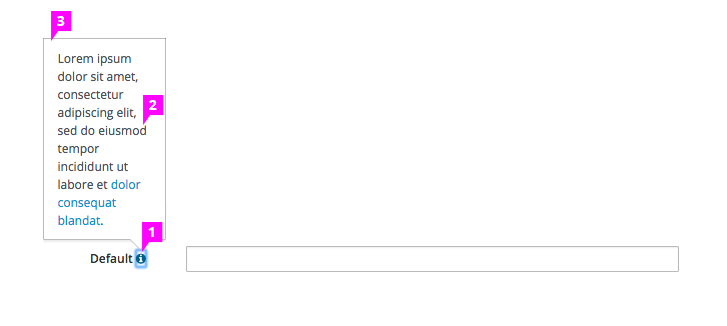

# Field Level Help

1. **Icon:** The help icon is Font Awesome icon, fa-info-circle, and is positioned to the right of the component. The icon is blue (pf-blue) to indicate that it is interactive.

1. **Text:** We recommend that the popover text does not exceed three sentences. If needed, include a link to online resources. The popover supports HTML formatting.

1. **Popover:** It is recommended that the popover is dismissed after the user’s next click.
