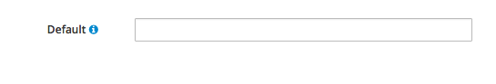

# Field Level Help

Field level help, denoted by the information icon, can be used when you need to provide supplemental information. The text is displayed in a popover when the user clicks on the information icon. While not limited to, the most common use case for field level help is seen on forms.

This pattern should NOT be used when:
- Compensating for bad design and relying on it to explain a graphic or word choice.
- The information displayed by the popover is necessary to read.

