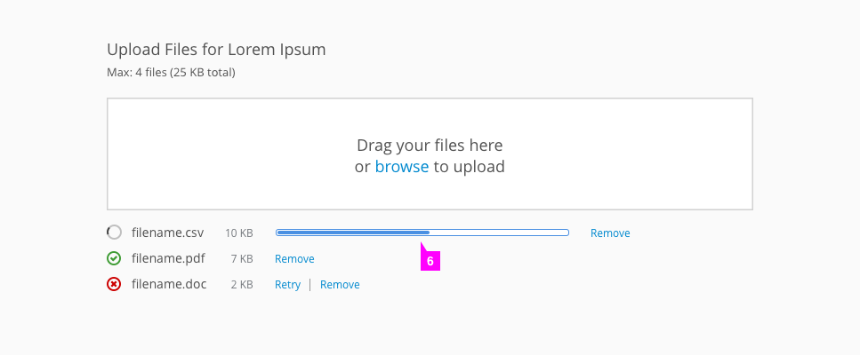
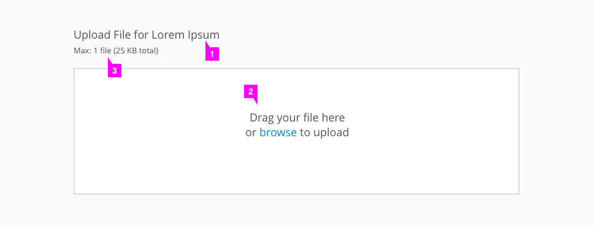
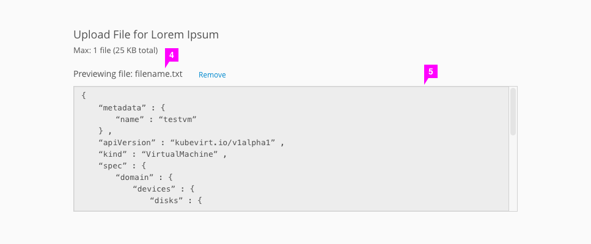
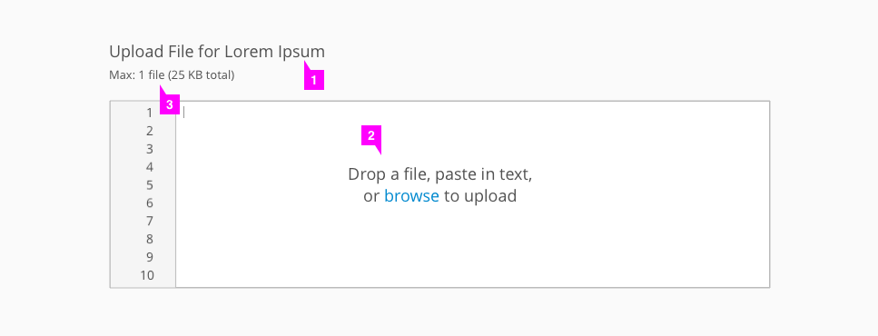
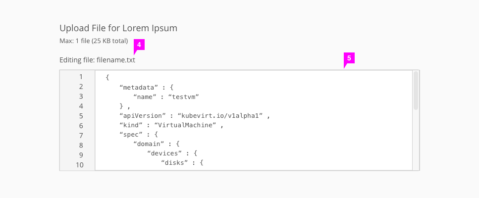

# File Upload

Patterns Available:
* [Multiple File Upload](#multiple-file-upload)
* [Single File Upload](#single-file-upload)
  * [Read-Only Preview](#read-only-preview)
  * [Editable Preview](#editable-preview)

## Multiple File Upload
Use this component when you need to upload one or more files without previewing the contents of the file.

1. **Header** (optional): Optionally use a title to give users context around the drag and drop component.
2. **Drag and drop area**: Users may drag and drop files anywhere in this box or click “browse” to open a file directory and search for files.
3. **Max files and size** (optional): Indicates to the user how many files they may upload and how large the upload may be.
4. **Hover state**: Upon dragging files over the drop area, the drag and drop area becomes outlined in blue and the text changes to “Drop Files Here.” The pficon-add-circle-o icon is shown beneath the cursor.
5. **Upload status**: After the files have been dropped, their upload status is shown.
  * **Success**: For files that have successfully uploaded, the pficon-ok icon will be shown to the left of the filename and the file size is listed to the right (optional). Users have the option to remove the file by selecting "Remove."
  * **Failure**: For unsuccessful uploads, the pficon-error-circle-o icon is used instead. Users have the option to select "Retry" or "Remove."
  * **Loading**: The Patternfly [spinner](http://www.patternfly.org/pattern-library/widgets/#spinner) and text indicate the current status of each file uploading.
  * **Note**: If a selected file does not match the requirements for the file upload, an error dialog will appear to inform the user that the file is unable to be uploaded. This includes instances where the user has attempted to upload a file of the wrong type or more files than allowed, for example.
6. **Loading bars** (optional): If files may take a while to upload and upload times can be determined, a loading bar can be shown to give the user better feedback on upload times.

## Single File Upload

### Read-Only Preview
Use this component when you need to upload one file with a read-only preview.

1. **Header** (optional): Optionally use a title to give users context around the drag and drop component.
2. **Drag and drop area**: Users may drag and drop files anywhere in this box or click “browse” to open a file directory and search for files.
3. **Max files and size** (optional): Indicates to the user how many files they may upload and how large the upload may be.
4. **Filename**: After the file has successfully uploaded, the filename is shown. Users have the option to remove the file by selecting "Remove."
5. **Preview box**: After the file has successfully uploaded, the drag and drop area becomes the preview box.

### Editable Preview
Use this component when you need to upload one file with an editable preview.

1. **Header** (optional): Optionally use a title to give users context around the drag and drop component.
2. **Drag and drop area**: Users may drag and drop a file anywhere in this box, click “browse” to open a file directory and search for files, or type or paste text directly into the box.
3. **Max files and size** (optional): Indicates to the user how many files they may upload and how large the upload may be.
4. **Filename** (optional): After the file has successfully uploaded, the filename is shown. This is only shown if a user chose to upload a file via drag and drop or using the "browse" link.
5. **Edit box**: After the file has successfully uploaded or the user has copied and pasted into the box, the edit box is populated with content and the empty state disappears. Users may edit the content by typing directly into the box.
  * If a user deletes the contents of the edit box, it will return to the original drag and drop state.
