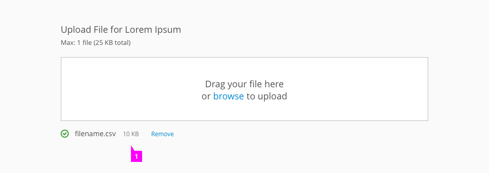
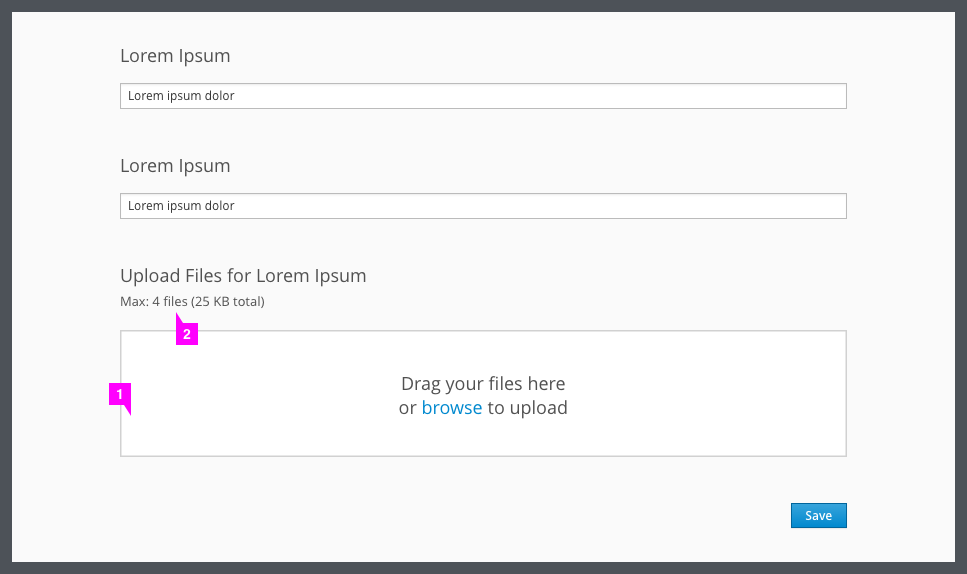
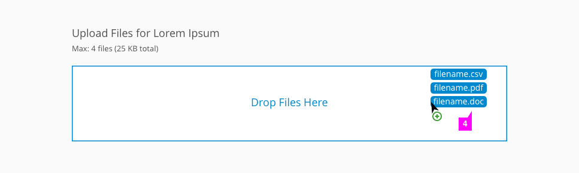
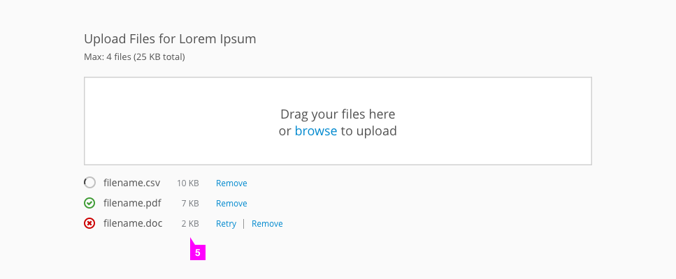
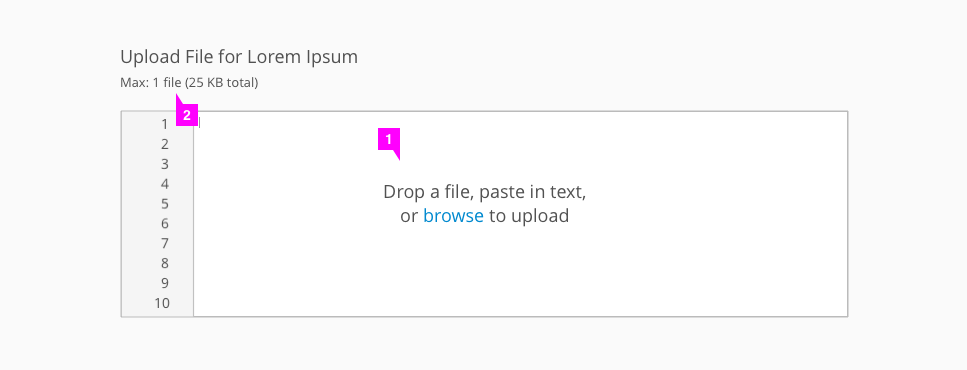
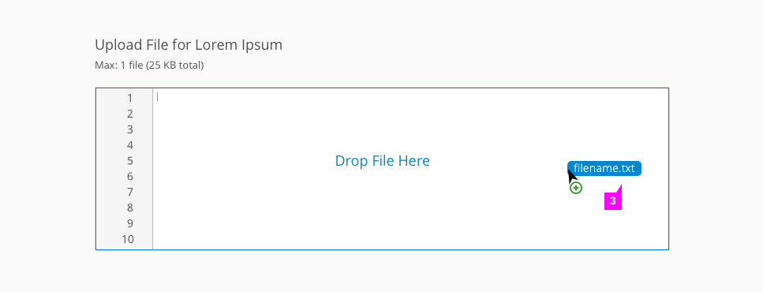
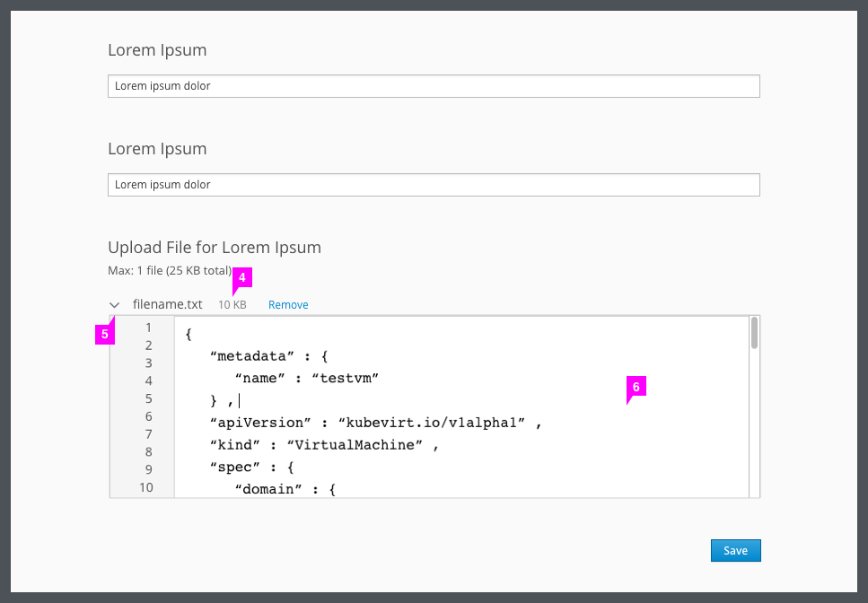

# File Upload

Patterns Available:
* [Single File Upload](http://www.patternfly.org/pattern-library/forms-and-controls/file-upload/#single-file-upload)
* [Multiple File Upload](http://www.patternfly.org/pattern-library/forms-and-controls/file-upload/#multiple-file-upload)
* [Editable File Upload](http://www.patternfly.org/pattern-library/forms-and-controls/file-upload/#editable-file-upload)

## Single File Upload

1. **Drag and drop area**: Users may drag and drop a file anywhere in this box or click “browse” to open a file directory and search for files.
2. **Max files and size** (optional): Indicates to the user how many files they may upload and how large the upload may be.
3. **Hover state**: Upon dragging a file over the drop area, the box becomes outlined in blue and the text changes to “Drop File Here.”
4. **Upload status**: After the file has successfully uploaded, it is shown with a green check indicator. The file is listed with its corresponding size, as well as the option to remove the file.

## Multiple File Upload

1. **Drag and drop area**: Users may drag and drop files anywhere in this box or click “browse” to open a file directory and search for files.
2. **Max files and size** (optional): Indicates to the user how many files they may upload and how large the upload may be.
3. **Hover state**: Upon dragging files over the drop area, the box becomes outlined in blue and the text changes to “Drop Files Here.”
4. **Upload status**: After the files have been dropped, their upload status is shown. Files still loading are indicated with a loading icon, successful uploads are indicated with a green check, and failed uploads are indicated with a red “x." If a file has failed to load, users have the option to select "Retry" or "Remove." Each file is listed with their corresponding size, as well as the option to remove the file.

## Editable File Upload

1. **Drag and drop area**: Users may drag and drop a file anywhere in this box, click “browse” to open a file directory and search for files, or type or paste text directly into the box.
2. **Max files and size** (optional): Indicates to the user how many files they may upload and how large the upload may be.
3. **Hover state**: Upon dragging a file over the drop area, the box becomes outlined in blue and the text changes to “Drop File Here.”
4. **Upload status**: After the file has successfully uploaded, it is listed with its corresponding size as well as the option to remove the file.
  * If the user clicks "Remove," the preview box returns to its original state.
5. **Caret dropdown** (optional): Once a file is successfully uploaded, the preview box will automatically load the content in an expanded view. A caret may be implemented so that users can collapse the edit box.
7. **Edit box**: After the file is uploaded or the user has copied and pasted into the paste area, they may edit the file by typing directly into the box.
