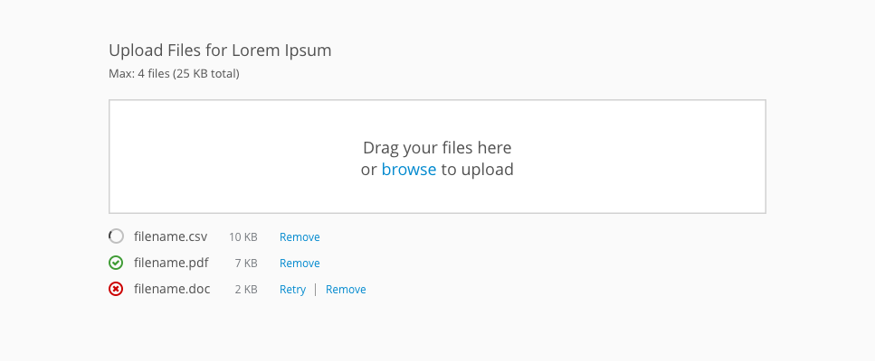
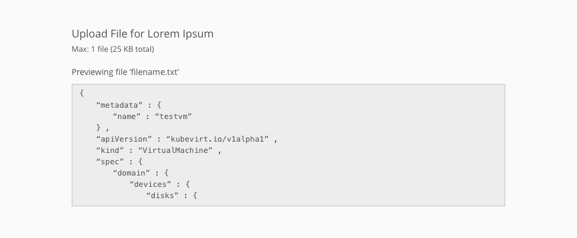
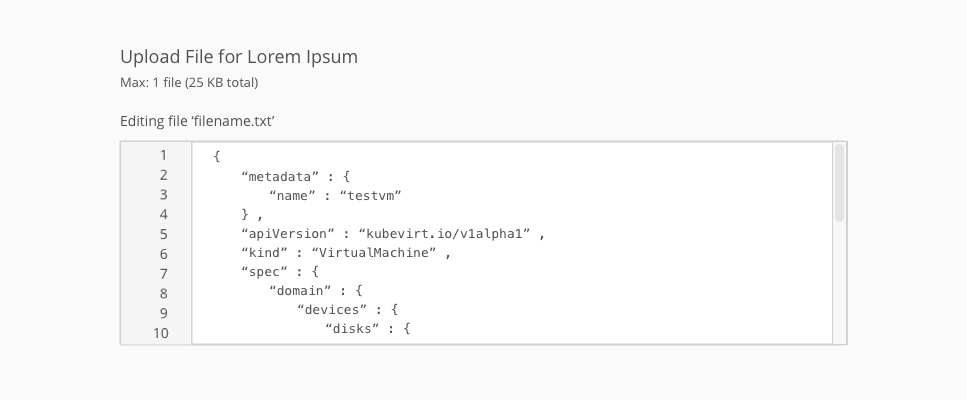

# File Upload

## Overview

The file upload pattern allows users to upload single or multiple files. The single file upload component can have either a read-only preview or an editable preview of the uploaded file. Multiple file upload does not have a preview.

This pattern has two main ways to interact with it: browsing for a file within a file directory or dragging and dropping a file. The editable preview version supports the additional interaction of typing or pasting text directly into the drag and drop area.

## Multiple File Upload

## Single File Upload

### Read-Only Preview

### Editable Preview

#### Use Cases

This pattern should not be used when the file select component provided by the browser will provide a smooth interaction for users of the product. We do recommend using this pattern in the following use cases:

* In situations where it is likely that the user would have the file handy from a recent download or interaction for dragging into the browser.
* When the user may need to upload multiple files, as the drag and drop will allow for a faster interaction than selecting multiple files through browsing.
* When a preview of the file is necessary to help confirm the content is correct.
* When a user might be adding a file into an text editing environment.
