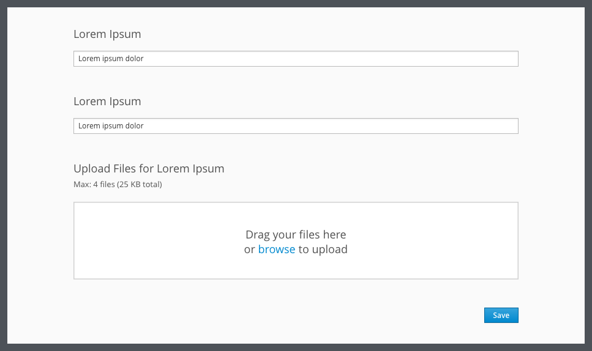

# File Upload

## Overview

The file upload pattern allows users to upload single or multiple files. This component has two ways to interact with it: browsing for a file within a file directory or dragging and dropping a file.

This pattern has the optional feature of showing a read only or editable preview of the uploaded file.

## File Upload Example

