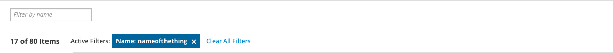
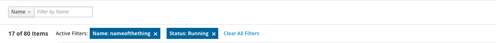
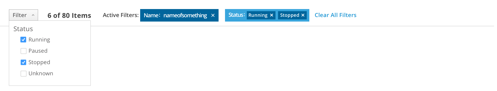

# Filter
Filters are rules that reduce the number of objects visible on screen at one time, and are often used to reduce visual clutter and focus only on the objects that matter to the user.
Use a filter when:
- Objects in the view have attributes such as names, statuses, colors, etc. by which they can be identified and organized
- Objects to be filtered are contained within a single page or view rather than spread throughout multiple sections of the application
- Objects in the view are independent and make sense regardless of their position on the page or relative to other objects
  - If you need to locate objects while preserving their positions on the page, use [find](http://www.patternfly.org/pattern-library/forms-and-controls/find/) instead

Filter is often displayed as a component of the [toolbar](http://www.patternfly.org/pattern-library/forms-and-controls/toolbar/), and can be paired with one of several filter triggers

Textbox filter (single attribute)

Textbox filter (multiple attributes)

Checkbox filter

Filter with inline active filters

