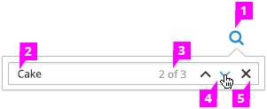

# Find

## Find Field

1. **Icon:** Clicking on the icon triggers the entire Find tool to dropdown.

1. **Text Entry Field:** The user’s query is entered here. When possible, results should be updated as the user types, or after they press the enter key.

1. **Position and Results Count:** The first number shows the position of the currently focused result. The second number shows the total number of matching objects.

1. **Previous and Next Result:** These buttons change focus to the previous or next result.

1. **Close:** Dismisses the Find dropdown and clears all shaded results.

## Find Results

1. **Found Objects:** All objects that match the user’s query are shaded to differentiate them from non-matching objects.

1. **Focused Object:** The first matching object is brought into view by scrolling or paging and highlighted. When the focus is changed via the previous/next buttons, the view should change, if necessary, to display the newly focused object.
