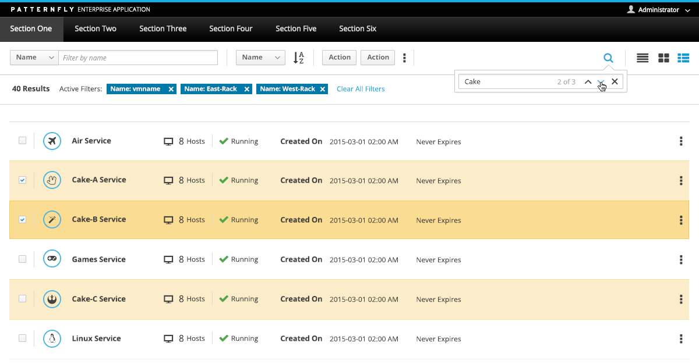
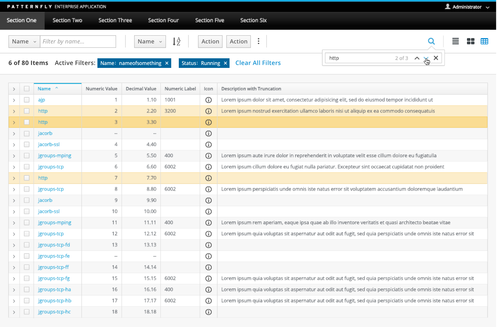
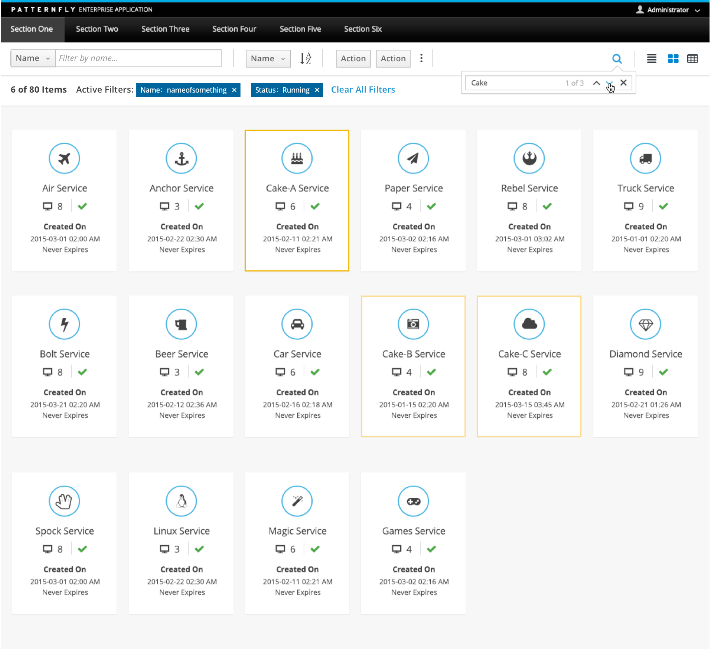

# Find

The find pattern is used to locate objects in a large dataset by entering a query. Unlike filter, find does not remove non-matching objects from view so it can be used to sift through a large dataset without losing the context provided by other displayed items. Find is displayed as a component of the [Toolbar](http://www.patternfly.org/pattern-library/forms-and-controls/toolbar/#_).

Find should not be used in the following cases:
- Paging is used and find cannot work across all pages.
- Infinite scrolling is used and find cannot work across the entire data set.

Jump to [Find in a List View](#find-in-a-list-view), [Find in a Table View](#find-in-a-table-view) or [Find in a Card View](#find-in-a-card-view)

## Find in a List View

## Find in a Table View

## Find in a Card View

