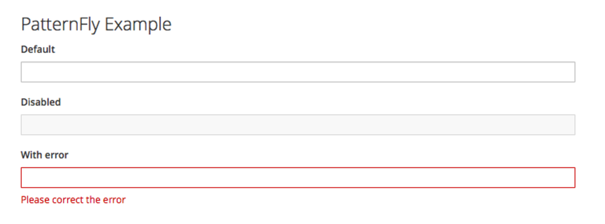
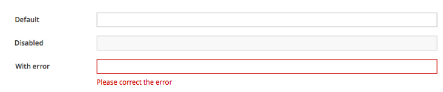

# Form Field Layouts

## Overview

Users enter data into form field inputs. Labels are always provided for input fields to help users understand what information is being requested of them. The orientation of the label to the input field is flexible to support a variety of use cases. This pattern has recommendations for three variations. In the case of multi column forms, it’s mostly best practice to avoid their use. The main problem is that using multiple columns within forms could cause the potential for users to interpret the fields inconsistently.

## Top Aligned Labels
A consistent left edge, along with close proximity of label and input, offers ease of use for both scanning and form completion. The possible disadvantage to this layout is the vertical screen real estate it requires.

### Use Cases
* The ability to complete the form quickly is a high priority.
* When label length might vary, e. g. internationalization support.
* The label length might be long, such as for “natural language” question-style labels.
* The user will be entering familiar content and is less likely to make data entry errors.
* Only a few form fields need to be presented.

### Ideal for the Following Viewports

* Desktop
  * Full screen (content, detail views)
  * Short dialogs & wizard screens (not too tall)

### Pros
* Offers the most horizontal area for long labels, relative to the other options.
* Labels can vary in length without affecting the overall presentation.
* Labels are in close proximity to the input fields - supports scannability and quick data entry.
* Related fields can more easily be grouped horizontally. For example [first name] [last name]
* The left vertical edge created by the labels allows  the user to easily scan the form to gain context.

### Cons
* Requires more vertical space than the alternatives.
* Because it’s so visually efficient, users might move too quickly through the form and potentially make data entry errors.

## Right Aligned Labels
The ragged left edge makes scanning for context difficult, although the proximity between label and input aids quicker form completion.

### Use Cases
* The user is likely to understand the overall context of the form, and scannability is not a priority.
* Completing the form quickly is a priority, but using the “top-aligned” format is not a viable solution.

### Ideal for the Following Viewports

* Desktop
  * Suitable for modal dialogues and wizards.
  * Full screen views: Ensure that there is sufficient margin to the left of the form labels to accommodate most labels.
* Tablet
  * Ensure that there is sufficient margin to the left of the form labels to accommodate most labels.  
* Mobile
  * To accommodate mobile viewports, right-aligned labels should be responsive by adjusting to a top-aligned layout.

### Pros
* Good for layouts with more horizontal space than vertical.
* Supports (western), left to right reading, between label and field.
* The label and the field are in close proximity, allowing the user to traverse quickly.
* The vertical margin between all the labels and inputs might aid scanning in long forms.
* Generally requires less vertical real estate, than top aligned form labels.

### Cons
* The irregular, ragged left edge of form labels makes this presentation visually busy and more difficult to scan.
* Does not offer lots of horizontal real estate for long labels, therefore is less suitable for internationalization needs.
* Long labels need to wrap to a second line, increasing vertical height and/or disrupting the order of the presentation.  

## Left-aligned labels
The strong vertical edge helps users to scan for context, although the distance between label and input might slow users down.

### Use Cases
* The user is presented with unfamiliar content, and would benefit from scanning the form to understand the overall context.
* The user needs to provide a well considered response - providing data related to critical or complex tasks.  
* It’s more important that the user pay close attention to the form material, rather than completing it quickly.

### Ideal for the Following Viewports

* Desktop
  * Preferable for modals and wizards.
  * Full screen views: User needs to be able to make the visual connection between the label and the input; ensure that there isn’t too much space between these elements.
* Mobile
  * To accommodate mobile viewports, left-aligned labels should be responsive by adjusting to a top-aligned layout.

### Pros
* Distance between labels and inputs might slow users down. Good for unfamiliar content or forms in which well considered responses are necessary.
* Users can easily scan the left edge to read the labels and understand the larger context of the form. Good for unfamiliar content.
* Generally requires less vertical real estate than top-aligned form labels.
* Supports (western), left to right reading between label and field.
* Good for layouts with more horizontal space than vertical.
