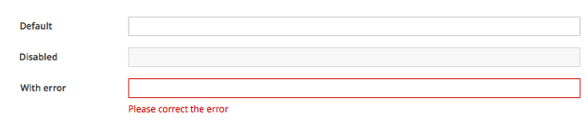

# Form Design Guidelines
This document is intended to help designers created consistent and usable forms using PatternFly components.  The following topics are addressed.

[Field Labeling](#field-labeling)

[Data Input](#data-input)

[Actions](#actions)

[Validation](#validation)

[Progressive Disclosure](#progressive-disclosure)

## Field Labeling

> Right aligned labels should be your default choice.  It has been shown that this approach leads to the shortest completion times.

> Use top aligned labels when you are space constrained or if mobile usage is a high priority.

Labels are always provided for input fields to help users understand what information is being requested of them. This pattern has recommendations for three variations to support different use cases.  Whatever approach you use, we recommend that you maintain consistency throughout an application.

### Top Aligned Labels
Top aligned labels provide a consistent left edge, along with close proximity of label and input. This offers ease of use for both scanning and form completion while requiring more vertical space than the alternatives.

Top aligned labels offer the most horizontal area for long labels, relative to the other options as labels can vary in length without affecting the overall presentation. Because the labels are in close proximity to the input fields this approach supports scannability and quick data entry. But because this approach is so visually efficient, however, users might move too quickly through the form and potentially make data entry errors.

##### Use When
* The ability to complete the form quickly is a high priority.
* When label length might vary, e. g. internationalization support.
* The label length might be long, such as for “natural language” question-style labels.
* The user will be entering familiar content and is less likely to make data entry errors.
* Only a few form fields need to be presented.
* Related fields must be grouped horizontally. For example [first name] [last name]

### Right Aligned Labels
The ragged left edge makes scanning for context difficult, although the proximity between label and input aids quicker form completion.

Right aligned labels are good for layouts with more horizontal space than vertical, and support (western), left to right, reading between label and field. The label and the field are in close proximity, allowing the user to traverse quickly, and the vertical margin between all the labels and inputs might aid scanning in long forms.

Despite these advantages, the irregular, ragged left edge of form labels makes this presentation visually busy and more difficult to scan. Long labels need to wrap to a second line, increasing vertical height and/or disrupting the order of the presentation.  

##### Use When
* The user is likely to understand the overall context of the form, and scanability is not a priority.
* Completing the form quickly is a priority, but using the “top-aligned” format is not a viable solution.
* For desktop and tablet interfaces, ensure that there is sufficient margin to the left of the form labels to accommodate most labels.
* To accommodate mobile viewports, right-aligned labels should be responsive by adjusting to a top-aligned layout.

### Left-aligned labels
The strong vertical edge helps users to scan for context, although the distance between label and input might slow users down.

Left aligned labels are good for unfamiliar content or forms in which well considered responses are necessary. Users can easily scan the left edge to read the labels and understand the larger context of the form while the distance between labels and inputs might slow users down. Like right-aligned labels, they support (western), left to right reading between label and field and are good for layouts with more horizontal space than vertical.

##### Use When
* The user is presented with unfamiliar content, and would benefit from scanning the form to understand the overall context.
* The user needs to provide a well considered response - providing data related to critical or complex tasks.  
* It’s more important that the user pay close attention to the form material, rather than completing it quickly.
* User needs to be able to make the visual connection between the label and the input; ensure that there isn’t too much space between these elements.
* To accommodate mobile viewports, left-aligned labels should be responsive by adjusting to a top-aligned layout.

### Indicating Required Fields

1. **Required field:** Required fields should be denoted with an * (asterisk) symbol.
  - Due to responsiveness issues, we do not recommend labeling optional fields with "(optional)"
1. Forms with a mixture of required and optional fields should include this explanation.

  

1. Forms in which all fields are required should include this explanation.
1. Forms in which all fields are optional should include this explanation.

### Displaying Units
Where applicable, units should be displayed to the right of any field where they are needed to provide clarity to the displayed data.

[Need an example here.]  

## Data Input

> Use radio button or checkboxes when you need to select from a small number of known options (2-5 options).  They provide users with the best visibility to choices.

> Select lists can be used when you have many options, are space-constrained, or  have variable options.

> On/off switches are a good alternative for enabling and disabling capabilities, but they should be used sparingly to reduce visual clutter.

> Use bound entry controls like datapickers, timepickers, or numeric touchspin  controls when entering strictly typed data.  This will reduce the need for field-level validation and prevent user input errors.

Forms enable users to input a variety of data.  Users may need to select from a fixed set of options or input a value directly.  Guidelines for selection from multiple options and entering values from the keyboard are included below.

### Selection Controls

#### Using Checkboxes, Radio Buttons, and Switches
Checkboxes, radio buttons, and switches are useful when you want to select from a list of optional settings.  Checkboxes should be used when allowing users to select one or more items from a list of options.  Radio buttons allow mutually exclusive selection.  As a general rule, radio buttons should not be used when more than 2-5 options are available or if you are space constrained.  In these cases a Select list is a better choice.

On/Off switches are a third option and can potentially take the place of a single checkbox or a set of two radio buttons.  Switches should only be used when the result will be to enable or disable some optional capability.  They may simplify labeling by allowing you to simply label the on/off switch with the name of the attribute being affected.  For general option selection, checkboxes should be the default choice.

#### Select Lists
Select lists provide an alternate method for selecting between multiple options when space is constrained or there are too many options to comfortable display on the page at once.  Select list should also be used when the options may vary.  

PatternFly offers two types of Select controls, Bootstrap Single-Select for selecting between mutually exclusive options and Bootstrap Multi-Select for selecting one or more options from a list.  When a small number of options exist, radio buttons or checkboxes are preferred over select lists as they serve to make all the options visible.

### Data Entry Controls

#### Text Entry
Text edit fields are the simplest and most common controls for allowing a user to enter a string of characters from the keyboard.  Edit fields should be appropriately sized to anticipate the longest value possible (if a maximum character length is known).  In cases where a value is too long to be fully displayed in an edit box, [truncation](http://www.patternfly.org/styles/terminology-and-wording/#_) should be used.

If the acceptable entries into a text edit field are constrained, syntax hints and field validation are recommended to prevent data entry errors.

#### Bound Entry Controls
Bound entry controls should be used when entering special data types, including dates, time, and other forms of numeric data.  These controls constrain user input and combine keyboard and mouse interaction.  They are designed to only allow valid inputs and therefore avoid the need for secondary validation.  See the DatePicker, TimePicker, and Bootstrap Touchspin components for more details.

## Actions

> Align submit buttons to the left (Save, Cancel) on full page forms and to the right (Cancel, Save) on modals.

> Buttons within forms should be placed immediately to the right of or below the item that they affect.

> Disable submit buttons until all required form inputs have been satisfied.

### Buttons on Forms
Buttons are the primary means for invoking actions within forms.  Submit buttons are generally placed at the bottom of the page to optimize top to bottom flow.  There should always be two buttons, a primary action button that will commit changes made by the user and a Cancel button that will abort those changes.  By default, the primary action will be labeled Save unless there is use case specific naming that makes more sense.  The Cancel button should always discard any changes and return the user to their prior state before opening this form (i.e., close the modal window or navigation back to the parent page.)  See the [PatternFly Terminology and Wording guidelines](http://www.patternfly.org/styles/terminology-and-wording/#_) for more guidance on button labeling.  

For full page forms, submit buttons should be left aligned at the bottom of the page where the primary action (Save) comes first from left to right.  On modal forms, the button are right aligned with the primary action as the right most button.

Buttons may also be used for actions within a form.  In these cases, the button should be placed to the right of or below the item that they affect.

[Link to button style guidelines for more detail about button appearance.]

#### Enabling and Disabling Actions
Submit buttons should be disabled when all conditions required for completing a form are not met.  This will reduce the need to return validation errors because the user neglected to complete the form.  When using disabled buttons, it should always be possible for the user to enable the button by inputing information onto the current page.  Do not use this technique for blocking functionality that is not available to the current user or requires changes outside of the current page.

## Validation

> Use inline notifications to display global errors or warnings associated with the form as a whole.

> Present field level validation to direct the user to specific items that are in error.  Where possible, errors should be presented immediately so the user may correct the problem and move on.

It is often necessary for the system to validate user input and communicate problems before a form can be successfully completed.
If a form field submission results in an error, it must be indicated to the user. Errors are always presented on individual form fields, they might also be indicated with an inline notification.

* Text input fields with validation errors are indicated with a red border around the input box and a Field Error Message below the field describing the error.
  * Field Error Messages should be specific and offer solutions. Example: The "@" character in "user@application" is not allowed. Try "user_at_application" instead.
  * When the error message is presented, content below will automatically get pushed out of the way to accommodate it.
* An (optional) inline notification might be presented as well, depending on the use case. See “Server-side validation.”
* Note: When a form is submitted, progress indicators (spinner or progress bars) should be used if the time to process the form submit action would exceed users’ expectations. For more information about progress indicators, see: [spinner](https://www.patternfly.org/widgets/#spinner) and/or [progress](https://www.patternfly.org/widgets/#progress).

#### When to Present Errors
The method for validating and communicating errors back to the user is largely dependent on where validation can be performed by the system.  When applying client-side validation, error checking can be performed directly in the browser.  This method allows for the most immediate feedback.  Server side validation requires error checking in the back-end and only results after the user has completed the entire form and clicked the submit button.

##### Client-side validation
When the user leaves a field, and the field loses focus, a validation error message will be presented dynamically on that field if an error exists. Note: Some use cases might require validation as the user types, where the syntax for each character is checked. For example: Checking IP address fields where the only valid characters are numbers and periods.

* Ensure validation is relevant to the field.
  * Example: Invalid characters for text input fields
* Depending on application constraints, dynamic (on-the-fly) dismissal of errors would be ideal as it provides a visual cue that the user has corrected the error.

##### Server-side validation
When the user submits the form, the entire page is reloaded with indications of validation errors for each field.
It is recommended that an inline notification get presented, at the top of the main content area, to assist the user in finding and correcting the specific field errors.

* The notification message should describe the error(s) and offer guidance for resolution. It might also include a count of the number of error(s). A total count is useful for long forms where individual field errors might be outside of the user’s current view.
* Once form errors are resolved and submitted, the inline (error) notification should be replaced with a confirmation message.

See [Inline Notifications](https://www.patternfly.org/widgets/#progress) for more information.

## Progressive Disclosure

> Use progressive disclosure to show or hide sections of a form based on some conditional input.

> Progressive disclosure is helpful when you want to reduce complexity by only revealing fields that are relevant based on some higher level input.

Progressive disclosure is used to hide and show fields based on a particular selection. The workflow is simple and the user can focus on the task at hand. This approach saves users’ time from unnecessarily identifying what fields can or cannot be interacted with. This approach is also helpful to color-blind users because it avoids using color to indicate whether or not a field is available.

Progressive disclosure results from some action taken on some parent selection control, i.e. a checkbox, a radio button, a switch, or a list selection.  That  result then triggers additional controls to be shown or hidden.  Content below these child controls will shift down or up depending on the selection.

Here are three examples:

* [Single Level](#single_level)
* [Multi Level](#multi_level)
* [Dropdown Menu](#dropdown)

#### Single Level Conditional Fields 

#### Multi Level Conditional Fields 

#### Conditional Fields with Dropdown Menu 

### Topics for Future Consideration
* Grouping form fields
* Inline editing (i.e. field by field editing without a submit button)
* Page level help
* Optional content on forms
