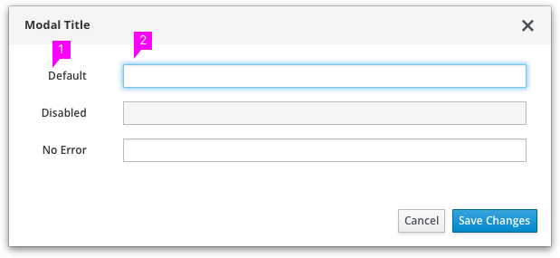
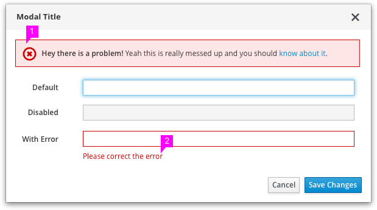
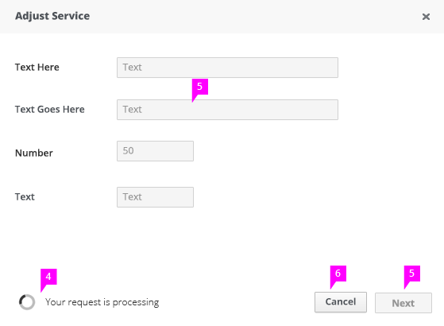

# Forms

## Form Text Fields

1. **Field Labels:** Do not include a colon at the end. Visit the Capitalization section of Terminology and Wording for information regarding capitalization.
1. **Primary Input Field:** This field gets focused when the modal appears. The initial primary input field is usually the first input field which is required.

**Additional notes about behavior for form fields**
- Populate fields with default values when possible.
- Support Enter key for button activation in the modal.
- If there is only one input field, pressing Enter key behaves the same as clicking primary button.
- Support Tab key (to progress forward) and Tab+Shift (to move backward) keys to move between input fields.
- Support the Tab key for all interactive elements. The sequence of tab indices should be determined according to the positions of the elements, from top to bottom, from left to right.
- Support Esc key to dismiss the modal without saving changes.

## Validation

1. **Form Level Validation** (optional): When the user submits the form, the entire page/modal is reloaded with indications of validation errors for each error via an inline notification. This notification is located at the top of the page, describes what the error is and preferably, offers guidance about how to fix the error. Additionally, if possible, you may want to inform the user the number of error(s) that have occurred, particularly if some of the errors are beyond the user’s current view.
  - Depending on application constraints, dynamic (on the fly) dismissal of errors would be ideal as it provides a visual cue that the user has corrected the error.
1. ** Level Validation:** In addition to the optional inline notification, the erroneous fields are indicated with a red outline with a message below the field describing the error and/or how to fix the issue.
  - Ensure validation is relevant to the field.
  - Messages should be specific and offer solutions.

  ## Operational Behavior

  

  The modal operation happens with the modal still open. Clicking the affirmative button starts the operation. If the operation completes successfully, the modal is closed.

1. **Progress indicator:** While the operation is happening, a spinner and processing text is displayed to the left of the buttons. Processing text should be succinct.
  - The modal should be designed in a manner to proactively designate space for the spinner to avoid reflow. The small spinner recommended as it is more conservative on space.
1. While operation is happening, everything in the modal is disabled, except the Cancel button.
1. Clicking the Cancel button during the operation cancels the operation and keeps the modal open.

### What’s not covered in the current design but will be covered in future sprints:

- Form Layouts
  - Basic, inline, and/or horizontal form
  - right-aligned vs. left-aligned labels
- Indicating required fields vs. optional
- Syntax hints
- Buttons
- Field-level validation on text entry
- Repeat user error validation
