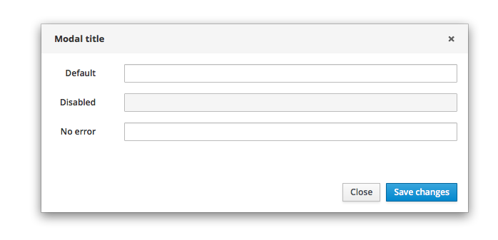
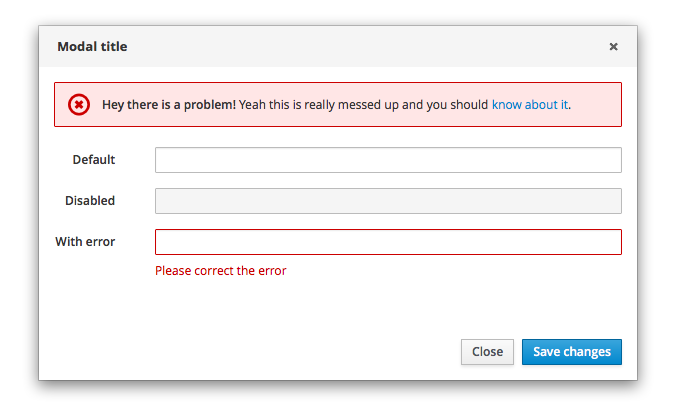
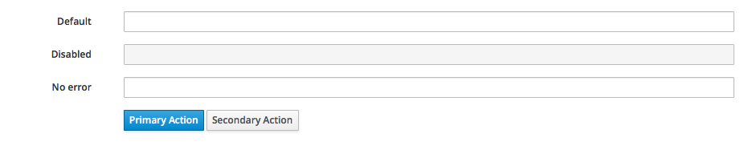
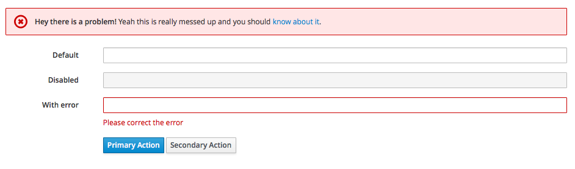

# Forms

Often overlooked, form text fields within modals or on a page are common elements that require definition as they are frequently used for a variety of applications. Well thought out, vetted forms should provide the user with an expected and efficient experience not only in it’s input function but also in its validation. Based on contributions from the Cockpit team, a form fields with input validation pattern has been devised. This pattern includes details about the form text fields, validation at both the form and field level as well as operational behavior.

Jump to [Within a Modal](https://www.patternfly.org/pattern-library/forms-and-controls/forms/#example-overview-1), [Within a Modal with Error](https://www.patternfly.org/pattern-library/forms-and-controls/forms/#example-overview-2), [Within a Page](https://www.patternfly.org/pattern-library/forms-and-controls/forms/#example-overview-3) or [Within a Page with Error](https://www.patternfly.org/pattern-library/forms-and-controls/forms/#example-overview-4)

## Within a Modal

## Within a Modal with Error

## Within a Page

## Within a Page with Error

