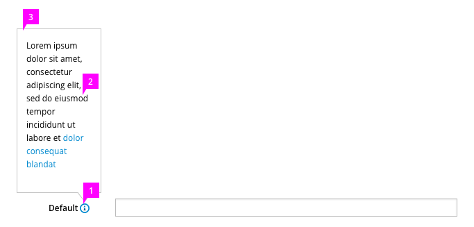
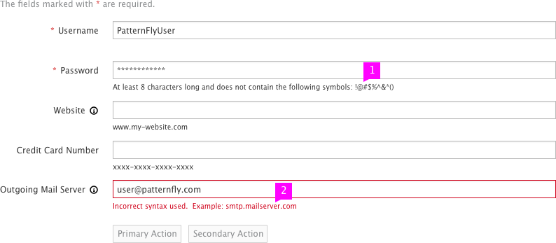

# Help On Forms

## Field Level Help

1. **Icon:** The help icon is a PatternFly icon (pficon-info) and is positioned to the right of the component. The icon is grey and changes on hover over to blue (pf-blue) to indicate that it is interactive.
1. **Text:** We recommend that the popover text does not exceed three sentences. If needed, include a link to online resources. The popover supports HTML formatting.
1. **Popover:** On click of the icon, the popover appears. The popover should be dismissed after the user has clicked outside of it.

## Syntax Hints

1. **Syntax Hint:** The hint is located beneath the text field and will remain visible even if the input field box are in different states (with the exception of the error state).
1. **Error State:** When the user provides data that is not valid, the hint will turn red to indicate they must input the data in the correct format.  Optional: Include an error message detailing what went wrong in addition to showing the syntax hint in red.

## What’s not covered in the current design:
- Alternative design solutions that work with assistive technology or older web browsers that do not support placeholder syntax hints.
