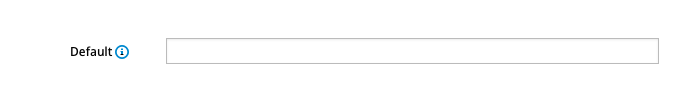
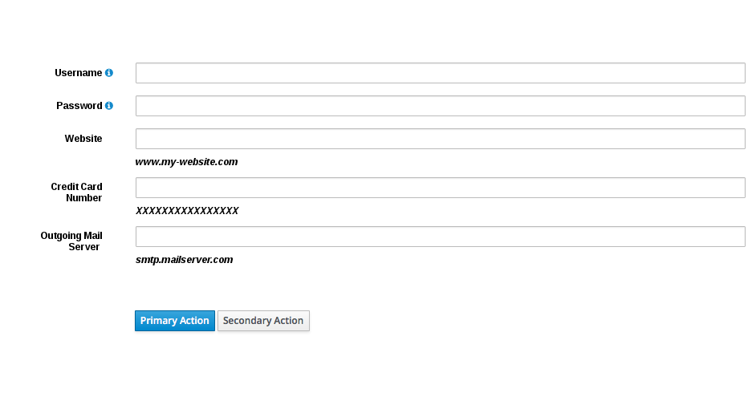
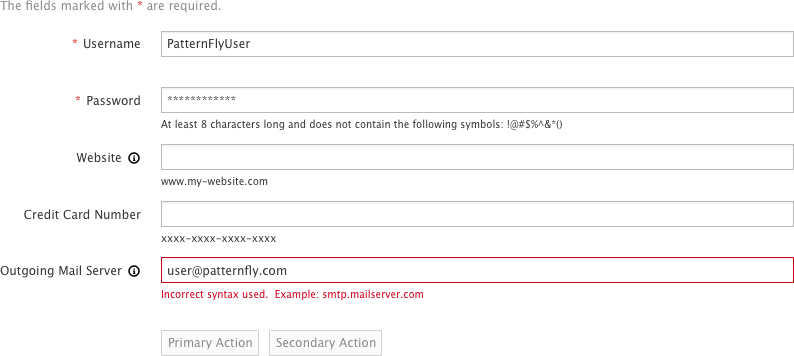

# Overview

There are a number of ways to provide additional help to users as they enter data into fields: field level help and syntax hints.

## Field Level Help
Field level help, denoted by the information icon, can be used to provide supplemental information. The help text is displayed in a popover when the user clicks on the information icon. Popovers are triggered on click, are mobile-friendly, and are ideal when links need to be listed in the help. While popovers are recommended, you can use tooltips if it is preferred to have the information appear on hover. Tooltips are best suited for desktop browsing, though they're supported on mobile devices as well.

While not limited to, the most common use case for field level help is seen on forms.

Recommendations for usage:
- Use wherever any field needs additional explanation
- The description length should be as concise as possible

This pattern should NOT be used when:
- Compensating for bad design and relying on it to explain a graphic or word choice.
- The information displayed by the popover is necessary to read.

## Syntax Hints
Syntax hints help users successfully complete forms by displaying an example of the required or recommended format for the input data. Syntax hints are useful when users are asked to provide unfamiliar data and there is a specific format the data should follow.

Recommendations for usage:
- Only use for open text input fields
- Limit use to avoid overwhelming the user
- The hint length should be as concise as possible and not extend the length of the text field

This pattern should NOT be used:
- When syntax requirements are complex and the explanation is lengthy - for example, when outlining password requirements.
- When the information is not necessary for the user to read to complete their task. In this case, use Field Level Help.
- As a replacement for form field labels. For more information, see [Field Labeling](http://www.patternfly.org/pattern-library/forms-and-controls/field-labeling/).

### Default state

### Page with errors

#### What’s not covered in the current design:
- Alternative design solutions that work with assistive technology or older web browsers that do not support placeholder syntax hints.
