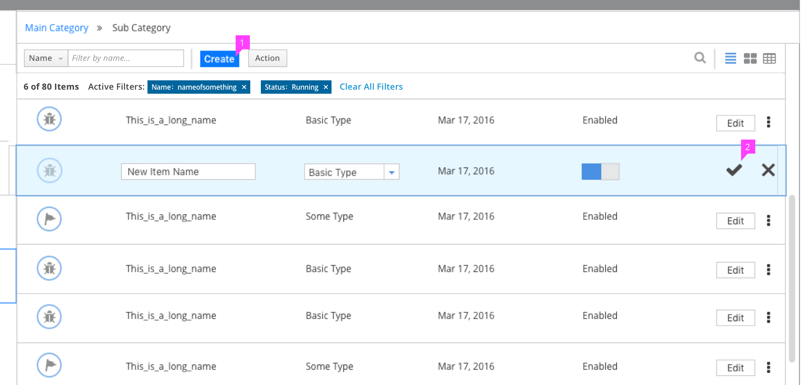
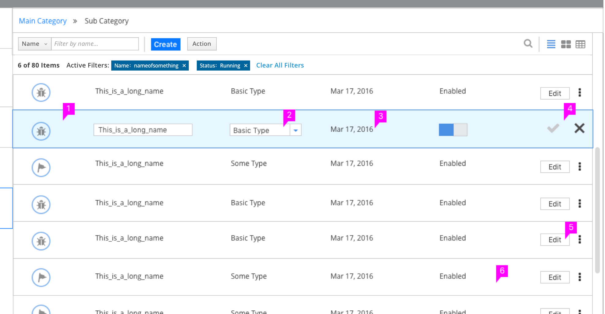
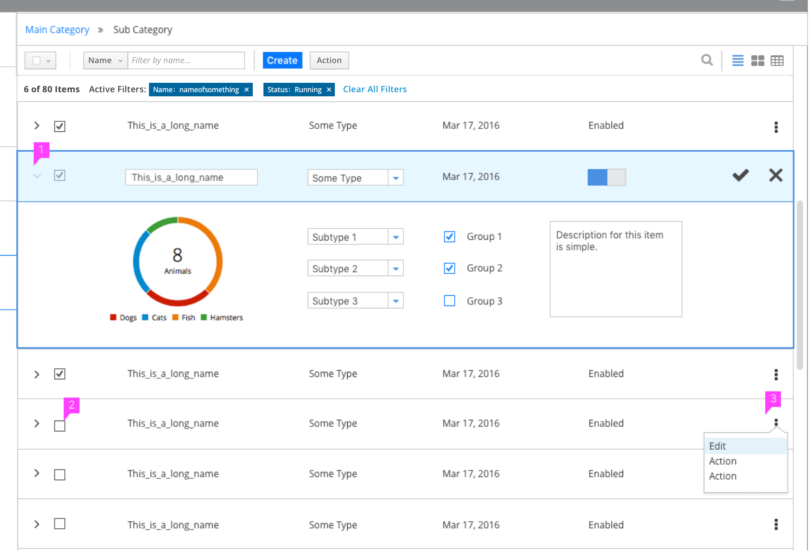
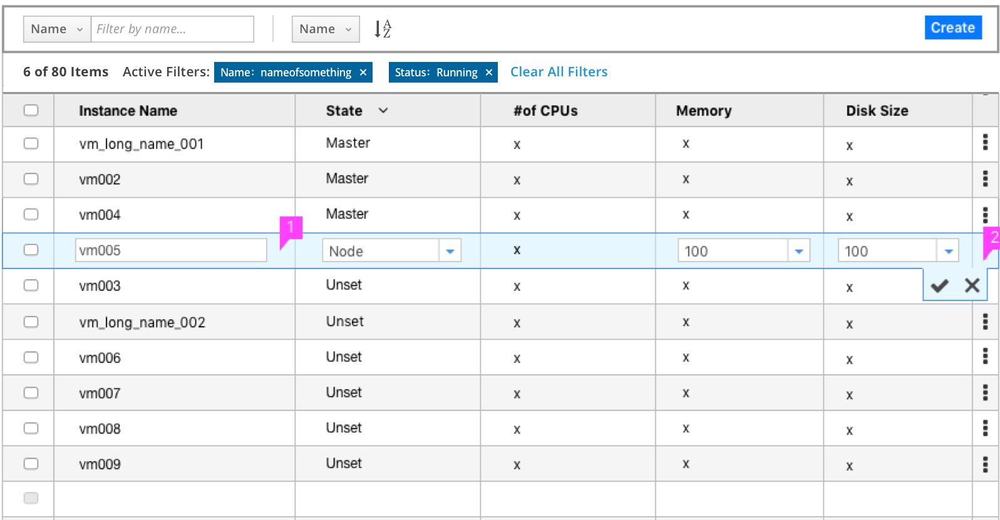
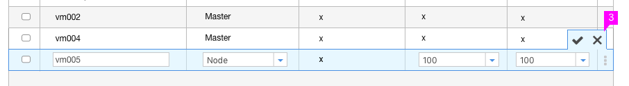
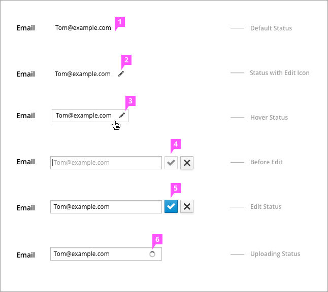
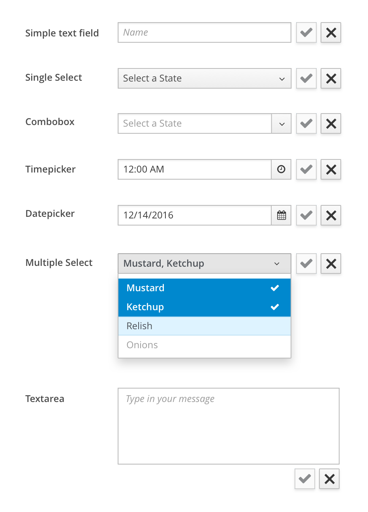

# Inline Edit
Inline Edit has a number of use cases, jump to a section below for applied examples:

- [Create and Edit](#inline-create-and-edit)
- [List Views](#inline-edit-in-a-list-view)
- [Expanded List Views](#inline edit-in-an-expanded-list-view)
- [Table Views](#inline-edit-in-a-table-view)
- [Forms](#inline-edit-in-a-form)

## Inline Create and Edit

1. **Create:** This action adds a row at the top of the list, in edit mode. All fields in the new row are editable. Default values for all fields are recommended.
2. **Save and Cancel:** These buttons are available on the right end of the row. "Save" button would never be enabled until required fields are entered. If user selects Cancel the new row is deleted.

## Inline Edit in a List View

1. **Row Selection:** Only one row can be edited at a time. Edit puts an entire row into edit mode. The row in edit mode should be visually distinct from surrounding rows. The first editable field should be in focus with an option to tab through all remaining editable fields with keyboard navigation.
2. **Editable Fields:**  These are fields in the selected row that should change from read only into an editable state such as a text field or combobox.  
3. **Non-editable Fields:** These are fields in the selected row that should not change in appearance.
4. **Save and Cancel:** These buttons are available on the right end of the row. The check mark (Save) and X (Cancel) should replace the kebab in the editable row. Save is disabled until a change is made.
5. **Edit:** This action puts the row into an editable state. This action may be accessed through a button, an icon, or the kebab menu.
6. **Click Away:** When a new or existing row is in edit mode and changes have not been made, clicking away should act as a cancel action, exiting edit mode without confirmation. If changes have been made to the editable row, a dialog should appear to ask the user if changes should be saved before exiting edit mode.

## Inline Edit in an Expanded List View

1. **Row Expansion:** If expansion behavior is supported, when a row is in edit mode, it should automatically expand. Editable fields that are not visible in the standard list can be edited in the expanded region. The X (close control) for the expanded region should be hidden; the expanded region cannot be collapsed in edit mode. The row should be returned back to the collapsed state once the user saves or cancels out of edit mode.
2. **Multi-Select:** Only one row can be edited at a time. If multi-select behavior is supported, and multiple rows are selected the row selections should persist when a single row is in edit mode but the associated actions should be disabled and the blue background highlighting of the selected rows should disappear. Upon exit of edit mode the row selections remain and the global actions are enabled. Upon exit of edit mode the row selections remain and the global actions are enabled.
3. **Edit:** This action may be accessed through a button, an icon, or the kebab menu and puts the row into an editable state.

## Inline Edit in a Table View

1. **Row Selection:** Only one row can be edited at a time. Edit puts an entire row into edit mode. The row in edit mode should be visually distinct from surrounding rows.
2. **Save and Cancel:**
  * These buttons are usually displayed in a tab under the bottom right corner of the row.
  * The check mark should be used for save and the X for cancel. Save is disabled until a change is made.
  * When the editable row is the last one in the table, these buttons are displayed in a tab above the row.

## Inline Edit in a Form

1. **Default Status:** The Information is displayed as text without edit icon.
2. **Status with Edit Icon:** If most of the information cannot be edited in the form, show the edit icon to the right of the field(s) that can be edited to help users easily identify editable fields.
3. **Hover Status:** When the mouse hover on the editable information, the edit icon (if not already shown)  and field border will appear. Click the text or edit button to make the field editable. If the text is a link, the user must click the edit icon to make the field editable.  
**Select:**  If the user clicks and holds, they should be able to select the text rather than transition into the edit mode.
4. **Save and Cancel:** These buttons are available on the right end. Save is disabled until a change is made. If user selects Cancel the text will go back to original state.
5. **Edit Status:** Save is activated.
6. **Spinner:** Sometimes the system needs user wait for a short time to update the data.
7. **Validation state:** User can click Save button to let the software validate the result. If the result is not correct, there will be an error message under the text field.

### Form Inline Edit Patterns

