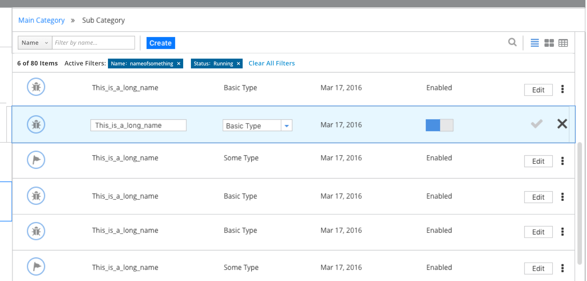
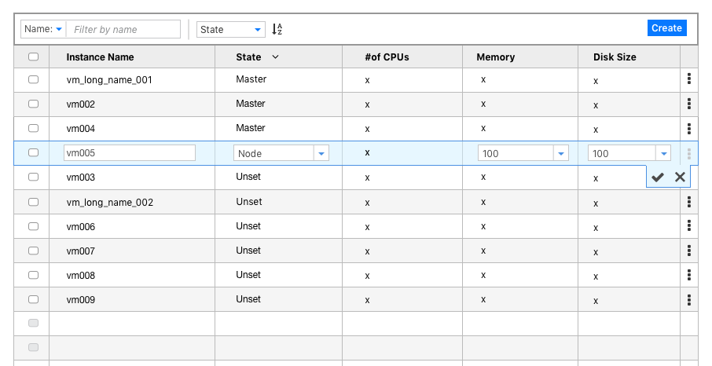
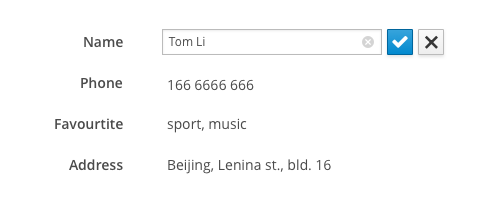

# Inline Edit

## Overview

Inline Edit allow the user to create or edit an item without navigating to another view.  Use this when all editable elements can be viewed within the row/ expanded row, or when a "quick add" option is available for users to edit a subset of items quickly. Inline Edit saves the user the need to open a modal window or navigate to a new view for simple object creation or edit actions.  

* Only one row in a list or a table can be edited at a time.  Users commit to or cancel changes by clicking **Save** or **Cancel**.

* Items can be added to the top of a list or a table by including an **Add** or **Create** action.  

## Inline Edit for List View

## Inline Edit for Table View

## Inline Edit for Form
The pattern enables users to edit the form text directly on the same page instead of navigating them to another page for editing the text. This is useful when the user may want to make a single edit without the need to refresh the entire form to make it editable. It could help user to improve the operation efficiency and reduce mistakes.

## Restrictions

1. If drill-down behavior is supported, this pattern should not be used.
2. This pattern does not include bulk actions (editing multiple rows at once).
