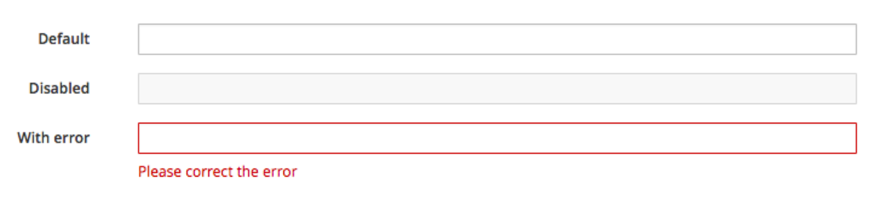

# Input Controls

## Overview

Text input fields are one type of input control. They are extremely common form elements, providing a useful foundation for form field recommendations. 

## Text Field Inputs
* Always provide a label.  Do not include a colon at the end of the label. Visit the Capitalization section of Terminology and Wording for information regarding capitalization.
* Pre-populate fields with known values when possible (eg. default IP address.)
* When presented in a form, the initial input field is usually the first input field which is required. The primary input field should receive focus, when the form is presented to the user. 

### Notes about keyboard interactions: 
* Support Enter key for submit (eg. “Save”), or any other primary form action.
* If there is only one input field, pressing Enter key behaves the same as clicking the primary button.
* Support Tab key (to progress forward) and Tab+Shift keys (to move backward) to move between input fields.
* Support the Tab key for all interactive elements. The sequence of tab indices should be determined according to the positions of the elements, from top to bottom, from left to right.
* When presented in a modal dialog, allow the Esc key to dismiss the window without saving changes.

