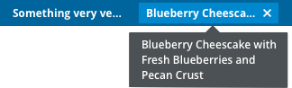

## Label
See http://getbootstrap.com/components/#labels for complete labels documentation.

## Compound Label

* Delete - Clicking on “X” deletes the compound label.
* Tooltip - When a compound label is truncated, we use labels to show the text.

* Read-Only Compound Label

