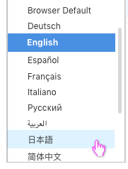

# Language Selector

The Language Selector should be used in applications that can be translated into more than one language. This selector should always be accessible from the [Masthead](https://www.patternfly.org/pattern-library/application-framework/masthead/#_) User section, but it may also be accessible from other areas within an application if desired. The list format and selection mechanism should remain consistent for all instances of the language selector.

