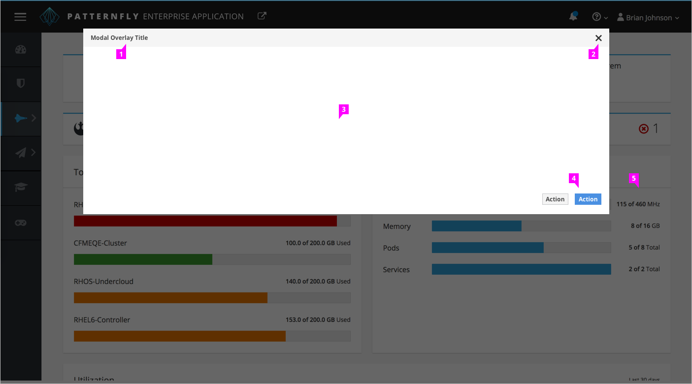
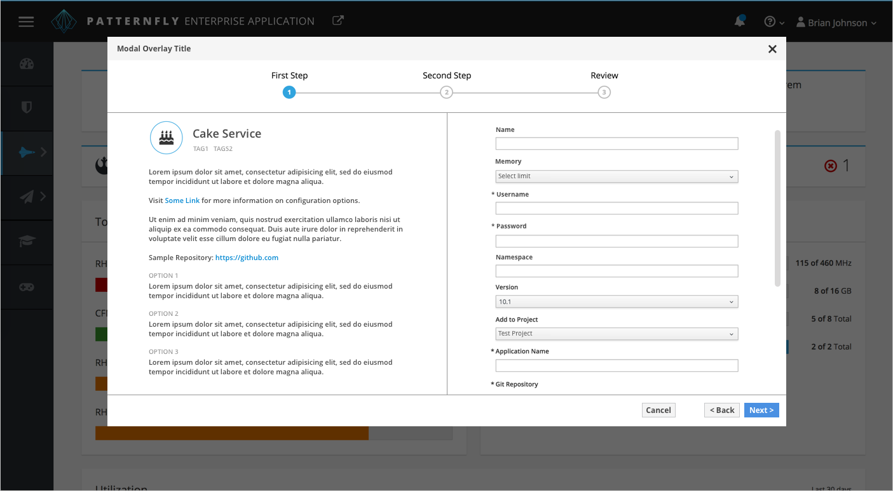

# Modal Overlay

1. **Title** (Optional): There should be a title bar spanning the top of the modal with a title in the top left corner. The title should be descriptive enough to convey the purpose of the modal while remaining concise. The title may match the action button or link that prompted the overlay modal to appear.

2. **Close:** The pficon-close icon should always be available in the top right corner to close the modal overlay.

3. **Panel:**
  - The panel should be animated to transition down from the top of the page
  - The panel should sit below the masthead
  - The panel should be centered with a maximum width
  - The panel height can vary depending on the content
  - There should be at least 20px of padding on the right and left side of the panel
  - There should be at least 50px of padding on the bottom of the panel
  - The panel should have a scroll bar if scrolling is needed to display all of the content

4. **Buttons:** Action buttons should be right aligned with the primary action as the right most button.

5. **Background:** When the modal overlay appears, the background should darken to bring attention to the primary content. While the rest of the page is no longer accessible, the background should still be legible to remain in context for the user.

## Short Example

## Long Example

