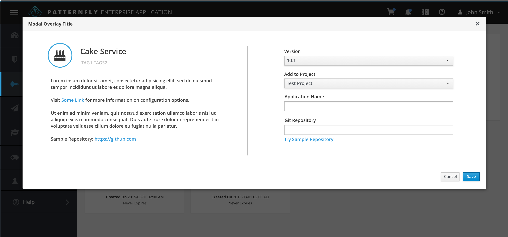

# Modal Overlay

The Modal Overlay pattern provides a way to quickly load and display important information to the user without navigating away from the current page. Use cases for Modal Overlays can vary a great deal, but some examples include the following:
  - To collect data from users
  - To remind or prompt users
  - To load dialogs that require user input before advancing
  - To load tasks which require a user's full attention, such as stepping through a wizard flow
  - To present important information or warnings

For specialized examples of the Modal Overlay, jump to the [Wizard](http://www.patternfly.org/pattern-library/communication/wizard/) or the [About Modal](http://www.patternfly.org/pattern-library/communication/about-modal/) patterns. For use cases that do not require a user's full attention, consider using the [Modeless Overlay](http://www.patternfly.org/pattern-library/forms-and-controls/modeless-overlay/) pattern. With the Modeless Overlay, the background is still accessible so users can interact with the rest of the page.

## Modal Overlay Example

