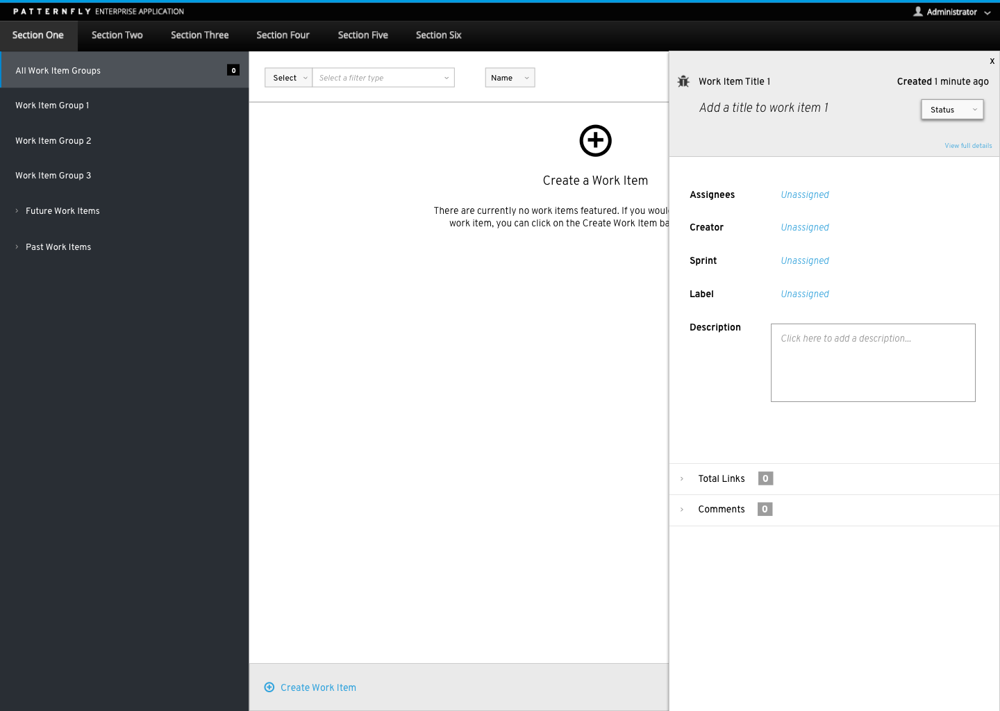
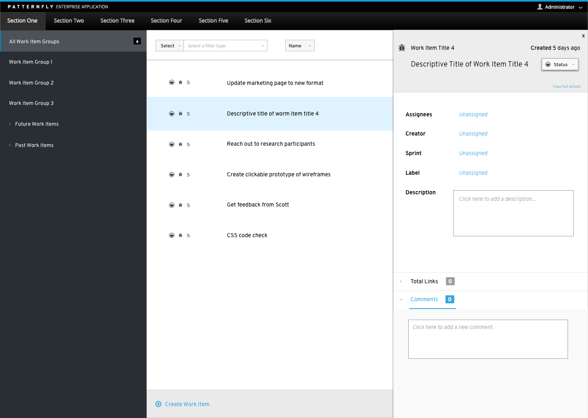
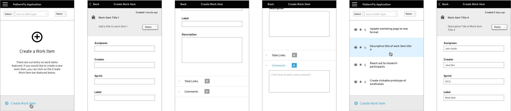

# Modaless Overlay

1. **Overlay Panel:** The panel itself rests right along the bottom of the top navigation but does not bleed onto the top navigation bar. There is a slight shadow around the overlay panel that helps to reinforce that it is located on top of the main page. The panel may come off of the underlying UI from different directions such as the top, left, right, or bottom. The overlay panel may not cover any persistent navigational elements such as a top or side navigation bar.

2. **Close Button:** The close button allows the user to dismiss the overlay pattern. When the panel is closed, there is a slight animation that shows the overlay panel sliding back into the side of the window.

3. **Title Area:** The primary title of the object helps to identify what is being shown on the panel and is featured at the top of the panel.

4. **Content Area:** Application specific content such as descriptive title, date, status, product owner, collaborators, description, etc. could live here.

5. **View Full Details:** Extends out the overlay panel to be a full page. The overlay panel could animate out and extend to be a full page.

**Animation Suggestions:**  The overlay panel should gently slide out from the side of the UI. There should be a slight shadow behind the panel that should go in time with the animation of the panel sliding out from the side.  When the panel is dismissed, the animation should slide the panel back into the side of the window that the panel came out of.

1. **Content Body:** The overlay panel may be used with a variety of different views such as list, table, or card view. When using the overlay panel in different types of content views, the user still has the ability to interact with the page underneath of the panel and can adjust the content of the panel by selecting a different object from the underlying page. The user can use their mouse or keyboard to change the content of the overlay panel.

1. On mobile, the overlay panel would extend to be full screen.
2. The overlay panel should act as an extension of the underlying UI. It presents more detailed information about the underlying UI.   
3. The panel can be dismissed by either swiping it left or right. Once the panel has been dismissed the user should be returned to the underlying UI.
4. When the overlay panel is open, it should be the only element that is immediately available for the user to interact with. In order to access the underlying UI, the user must exit the overlay panel.
5. Content and labels should be featured on the top of the input fields. 
