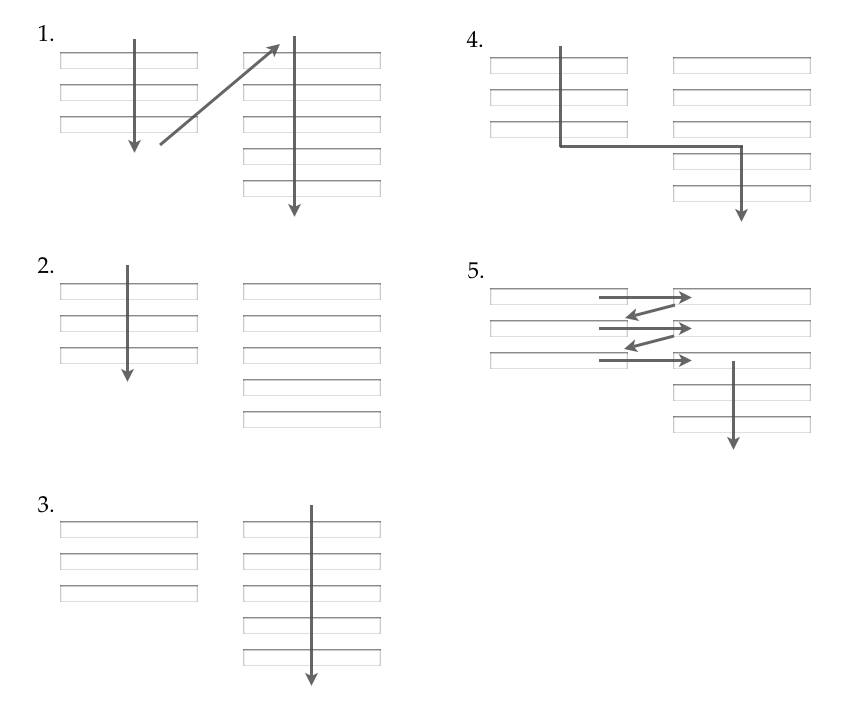
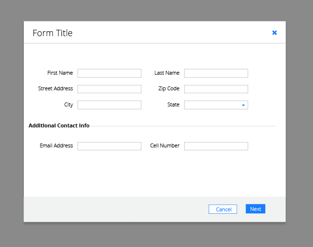
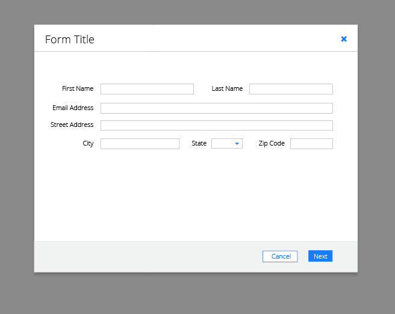
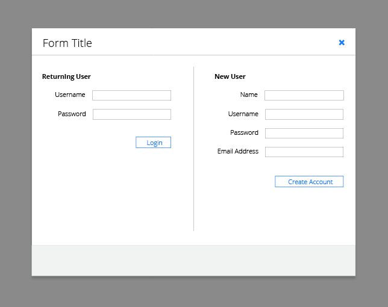

# Multi Column Forms - Conceptual Design

## Overview

The PatternFly team is working on the conceptual design for multi column forms. However, this concept is slightly different from other patterns the team has worked on.

**We are exploring if there is ever a good use case to use multi-column forms, and if so what are they?**

Forms are a valuable tool because they offer a variety of layouts that can be used to organize your content for users to complete in a meaningful manner.

However, in the case of multi column forms, it’s mostly best practice to avoid their use. The main problem is that using multiple columns within forms could cause the potential for users to interpret the fields inconsistently.  Below are 5 examples of ways multi column forms could be interpreted.

As you can see, multiple columns interrupt the vertical impulse to move down the form. Rather than forcing the users to visually reorient themselves, it’s best to keep them in a consistent  flow by sticking to a single column layout.

However, there are a couple exceptions that seem to be acceptable.

## Recommendations

### Example 1

The main exception for using multi-column forms that cause the least amount of confusion were for short fields as well as logically related fields.  The most common example are name and address fields (*City, State, and Zip Code*).

This type of content is standard and easy for users to follow. One suggestion for this format is to align the labels above the fields, rather than to the left. The thought was that this makes the grid stronger and thus, easier to map the fields visually.   Do you agree or disagree? This could be something we could explore for this pattern if we decide to move forward with it. In this case the labels are kept to the left to stay consistent with our general form design.

Another variation is instead of a standard two level format, use various columns. Keep in mind that this will works best for related short input fields.

### Example 2

The second exception is when there are to different form choices.  User must choose to fill out one or the other.  In this case, when the forms fields are shown next to each other in a multi column format, there is little confusion as long as the distinction of the two form choices are clear.

There were several thoughts on this use case. First being that this would be considered two single column forms next to each other, rather than a multi column form. The second being that instead of this format, opt for a preselection for new or returning users.  This would then display a single form rather that two side by side.
