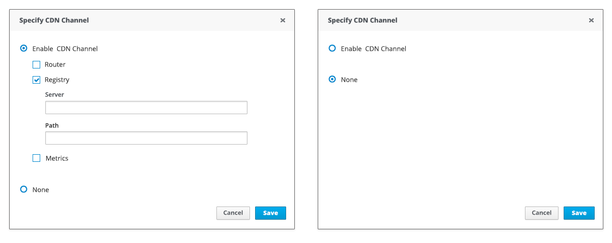

# Progressive Disclosure

## Overview

This pattern uses progressive disclosure to hide and show fields based on a particular selection. The workflow is simple and the user can focus on the task at hand. This approach saves users’ time from unnecessarily identifying what fields can or cannot be interacted with. This approach is also helpful to color-blind users because it avoids using color to indicate whether or not a field is available.

## Description

The pattern includes three examples:

* [Single Level](#single_level)

* [Multi Level](#multi_level)

* [Drop-down Menu](#drop_down)

## Examples

### Single Level Conditional Fields 

### Multi Level Conditional Fields 

### Conditional Fields with Drop-down Menu 

