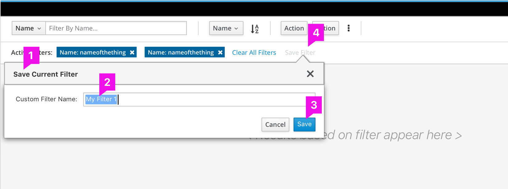

# Saved Filter
## Save Option

1. **Placement of the Save Icon**  : The Save option appears in the Active Filter Area.

1. **Availability of Save Option:** If the current filter applied is not already saved, then the save button should be enabled else it will remain disabled.

1. **Disabled State of Save Option ** : The Save option remains disabled, if the filters in the Active filter-bar are already saved by the user.

## Saving Filter Dialog

1. **Invoking The Saving Dialog **: The save icon/button when clicked the user is presented with a dialogue to enter a name for the filter.
1. **Default Name of The Saved Filter ** (optional): The Filter name text field, provides a default name based on some predefined or pre-configured pattern, that helps the user to save the filter with minimal clicks.
1. **Saving the Saved Filter **: The save button  on the dialog saves the filter in the system.
1. **Disabled State of the Save Option**: Note that the Save Option in the Active Filter bar turns disabled, while the dialog is open. If the user saves the current filter then post saving the Save Option remains disabled. In case the user canceled the dialog without saving the filter, the Save Option gets enabled again.
1. **User Defined Filter Name**: If the user can provide a custom name for the filter in the filter name field before saving.

## Sucess Message of Saving a Filter

1. **User Notification:**
User is notified that the filter is saved.This may be through toast messages or alert boxes or any other means that makes the user aware that his filter is saved.  

## Accessing the Saved Filters

1. **"My Filters" Section in the Filter**:All of the saved filters are grouped under "My Filters" in the Filter Bar dropdown.

1. **Accessing the Saved Filters **:To access the saved filters, the user selects "My Filters" in the filter bar.

1. **Invoking the List of Saved Filters **: Once the "My Filters" is selcted, the user can click on the carat on the filter bar to invoke the flyout with the list of saved filters. The list is sorted alphabetically or based on most recent to oldest (Optional - this behaviour can be pre-configured).

1. **Selecting the Filter from the List **: The user selects the desired filter name from the list.
1. **Type Ahead Feature **: The user can also type in the text box the name of the filter name he is looking for. While he types in, the type ahead appears with the matching saved filter names.1. **Saved Filter Applied **: Based on the saved filter selcted, the result based on the filter takes effect in the view. The active filter bar appears with all the filter parameters used in the applied filter. 

## Delete a Saved Filter

1. **Delete icon in the list **: While the user rolls over any item on the list, the delete icon appears next to the filter name. Clicking on this icon removes the corresponding filter.
