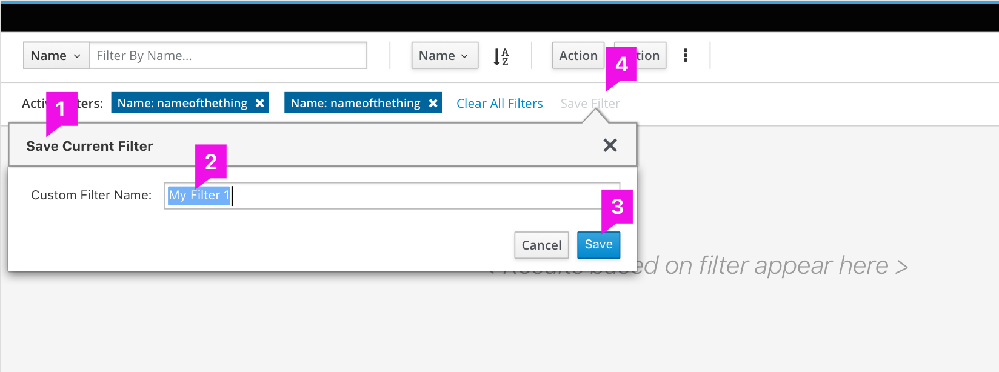

# Saved Filter

## Overview  

Custom Filter helps the user in saving any applied filter criteria with a name so that at a later point in time they can access their saved filter criteria and apply for the desired result set.

## Use Cases

This pattern should be used where users want to save filters they have built out for future use.

### Saving a Filter

### Accessing a Saved Filter
 
