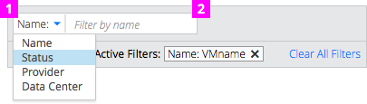
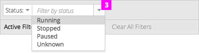
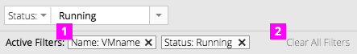

# Filter

## Filter Bar

  1. **Attribute Selector** (optional)**:** Contains a list of the possible attributes by which to filter.

  1. **Filter Query Field:** Use when there are more than 15 possible values. The user’s filter query is entered here. The filter is activated when the user presses the “enter” key and all objects that do not have a match to this value are hidden.

  1. **Filter Query [Dropdown] (http://www.patternfly.org/pattern-library/widgets/#dropdowns "Widgets | PatternFly")** (optional)**:** Use the filter query dropdown when there are less than 15 possible values to allow the user to select from a known and fixed value list (e.g a list of statuses). The filter is activated when the user selects a value. Objects that do not have this value are hidden.

## Active Filters Bar

1. **Active Filter:** Filters are labeled with the attribute and value used to create them. Clicking the X in the box will remove the filter. New filters appear to the right of existing filters and are highlighted briefly upon appearance. If no active filters exist, the active filters bar is hidden.

1. **Clear All Filters:** Clicking this action removes all currently active filters.

1. **Item and Results Count:** TBD

**Notes:**
- Each filter is additive in nature, meaning that adding further filters will reduce the overall set of results. Filters are combined with the AND boolean for the results they return.

- If an attribute can only have one filter value at any time, selecting a new value will replace the previous filter rather than adding a new one.
