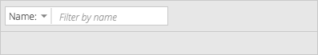

# Filter

## Overview
Filter is a component that enables a user to quickly apply stackable filters to a table or page full of objects. Filtering reduces the number of objects visible on screen at one time, and is often used to reduce visual clutter and focus only on the objects that matter to the user.

Filter is often displayed as a component of the Data Toolbar.

## Examples

