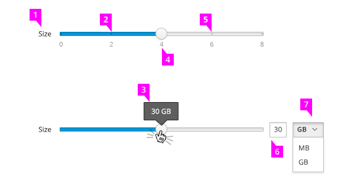
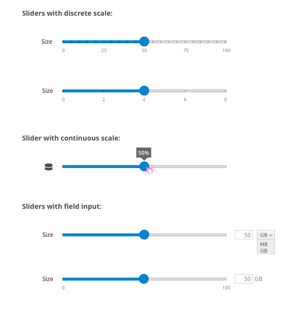
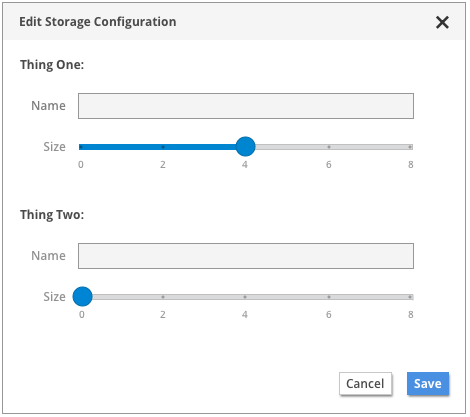

# Slider

1. **Label:** There should be a slider label to the left of the slider, indicating what the slider values represent. A text string or an icon may be used in the label position.

2. **Slider Handle:**
  - The slider handle should sit on the selected value.
  - The slider handle should move when users click and drag, when users click on a new area along the slide, and when users enter a new value in the field input.
  - For discrete sliders, the handle should snap to the closest tic mark value.
  - The slide area to the left of the handle should be highlighted in blue, with the slide area to the right in grey.

3. **Tooltip:** The current value should be displayed in a tooltip when users hover or click on the slider handle.

4. **Numeric Scale** (Optional):
  - A numeric scale may be displayed below the slider.
  - Displaying a numeric scale is recommended when using a discrete slider that snaps to specific values.
  - Note: The scale is not required to denote ALL discrete values.  

5. **Discrete Values** (Optional): When using a discrete scale, each available value may be indicated using marks along the slider. The marks make it clear to users when the slider will snap to specific values.

6. **Field Input** (Optional): The slider can optionally have a field input on the right side to enter the desired value as an alternative to sliding. The slider button should move to indicate the value entered.

7. **Unit Dropdown** (Optional): A dropdown may be provided in conjunction with the field input if various units are available for selection.

## Slider Examples

## Slider Example In Context

#### Future Considerations
- Sliders with two draggable handles, allowing users to set a range
- Vertical sliders
- Sliders with interactive buttons, allowing users to jump to specific values without dragging the slider handle
