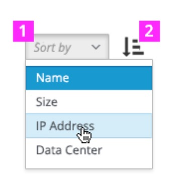
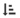
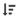

# Sort

  1. **Sort Selector:** Contains a list of the possible attributes by which to sort. Objects may be sorted by any attribute, including properties that are not displayed in the current view. (e.g. attributes in hidden columns, or those that are not displayed in a tile)The default sort order should be one of attributes ( for example”Name” will be shown on defaul

  1. **Sort Order Toggle:** Sort can toggle between ascending and descending order. The icon on this button changes according to the order of the current sort. The default for sort is ascending order.

  See available sort icons below and when they should be used.

| Icon                                        | Class Name               | Tooltip Text | Screenreader Text (aria-label)       | Comments           |
| ------------------------------------------- | ------------------------ | ------------ | ------------------------------------ | ------------------ |
|  | fa-sort-alpha-ascending  | Sort A to Z | Sorted A to Z. Toggle to sort Z to A. | When data to be sorted is alphabetical, use this icon to communicate the sort orde. |
|  | fa-sort-alpha-descending | Sort Z to A | Sorted Z to A. Toggle to sort A to Z. | See comments in previous row. |
|   | fa-sort-numeric-ascending | Sort 1 to 9 | Sorted 1 to9. Toggle to sort 9 to 1. | When data to be sorted is numeric, use this icon to communicate numerical sort order. |
|  | fa-sort-numeric-descending | Sort 9 to 1 | Sorted 1 to9. Toggle to sort 1 to 9. | See comments in previous row. |
|   | fa-sort-common-ascending | Sort small value to large value | Sorted small to large value. Toggle to sort large to small value. | Use this icon to communicate sort order for other data types, such as sort by size,sort by date,sort by distance,etc. |
|  | fa-sort-common-descending | Sort large value to small value | Sorted small to large value. Toggle to sort large to small value. | See comments in previous row. |
