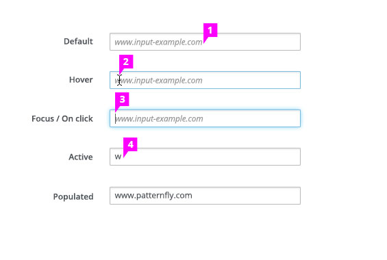

# Syntax Hints

  1. **Syntax hint:** In a default state, the hint is located inside the text field as a placeholder.
  1. **Cursor on hover:** On hover, the mouse cursor appears over the placeholder hint.
  1. **Cursor after click:** When the user has clicked into the text field, the placeholder hint remains visible and the cursor becomes active inside the text field.
  1. **Input data:** The placeholder hint disappears once the user has begun typing in the text field. If the user removes the input data from the field, the syntax hint is restored to its original state.
