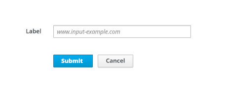

# Syntax Hints

Syntax hints help users successfully complete forms by showing an example of the format their input data must be in. Syntax hints are useful when asking for unfamiliar data and there is a required way of providing that data.

Recommendations for usage:
* Only use for open text input fields
* Limit use to avoid overwhelming the user
* The hint length should be as concise as possible and not extend the length of the text field

This pattern should NOT be used:
* When syntax requirements are complex and the explanation is lengthy, for example, when outlining password requirements.
* When the information is not necessary for the user to read to complete their task. In this case, use [Field Level Help](http://www.patternfly.org/pattern-library/forms-and-controls/field-level-help/#/api).
* When input data can be validated using client-side validation. For guidance, see [Errors and Validation](http://www.patternfly.org/pattern-library/forms-and-controls/errors-and-validation/#/api).
* As a replacement for form field labels. For more information, see [Form Field Layouts](http://www.patternfly.org/pattern-library/forms-and-controls/form-field-layouts/#/api) Form Field Labels.

## Default state

