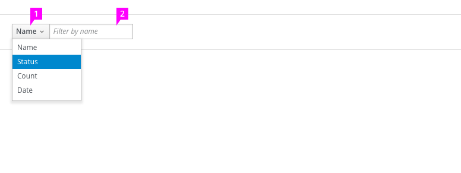
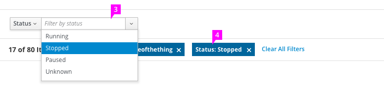
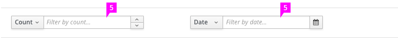

# Textbox Filter

  
  1. **Attribute Selector** (optional): Contains a list of the possible attributes by which to filter.
  1. **Filter Query Field**: The user’s filter query is entered here. Filters may be activated as the user types, or if that is not possible, when the user presses the “enter” key. When the filter is activated, all objects that do not have a match to the value in this field are hidden.

  
  1. **Filter Query Dropdown** (optional): Use the filter query dropdown when the possible values for the attribute are known ahead of time and can be arranged into a fixed list (e.g a list of statuses). The filter is activated when the user selects a value. Objects that do not have this value are hidden.
  1. **Active Filters**:  See [filter](http://www.patternfly.org/pattern-library/forms-and-controls/filter/) for a description of active filters and their behavior.

  
  1. **Special Query Field** (optional): Certain types of values, such as numerals, dates, and times, have special input fields that make them easier to enter. These special input fields should be used in place of the normal textbox when they exist for the selected attribute. Examples include the [touchspin](http://www.patternfly.org/pattern-library/widgets/#bootstrap-touchspin) [datepicker](http://www.patternfly.org/pattern-library/widgets/#bootstrap-datepicker) and [timepicker](http://www.patternfly.org/pattern-library/widgets/#timepicker).
