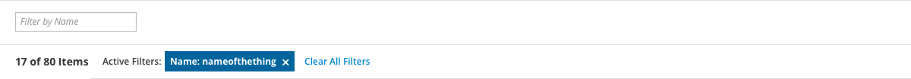
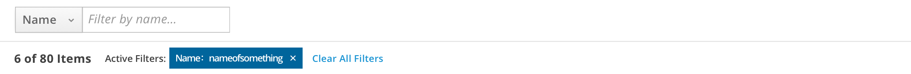

# Textbox Filter

The textbox filter is a component that enables a user to apply filters by entering values in a text entry field. These filters can be limited to a single attribute, such as name, or can be applied to a number of attributes available in an attached dropdown.

Use a textbox filter when…
- The user is familiar with the dataset and is trying to locate items that they already know exist
- The important attributes to filter on are mostly open-ended values such as names, creation dates, or numerals rather than discrete categories.
- If the user is not familiar with the dataset or looking for items that have specific traits from a list of discrete categories, use a [checkbox filter](http://www.patternfly.org/pattern-library/forms-and-controls/checkbox-filter/) instead.

A single-attribute textbox filter

A multi-attribute textbox filter

